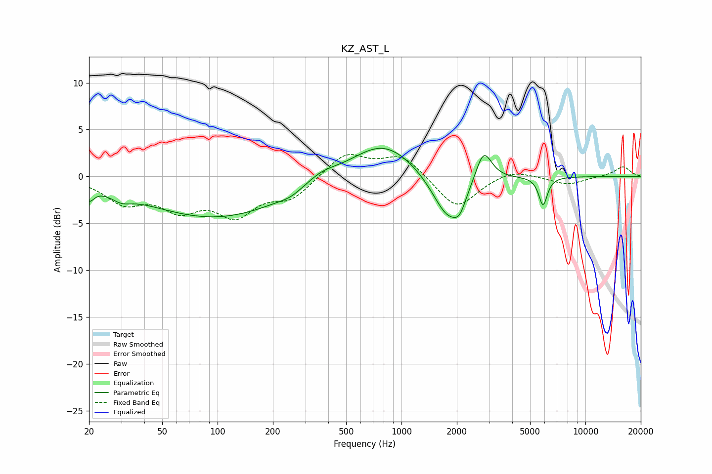

# KZ_AST_L
See [usage instructions](https://github.com/jaakkopasanen/AutoEq#usage) for more options and info.

### Parametric EQs
Apply preamp of -3.1 dB when using parametric equalizer.

|   # | Type    |   Fc (Hz) |    Q |   Gain (dB) |
|-----|---------|-----------|------|-------------|
|   1 | Peaking |        20 | 5.28 |        -1.4 |
|   2 | Peaking |        30 | 2.59 |        -0.8 |
|   3 | Peaking |        98 | 0.37 |        -4.4 |
|   4 | Peaking |       249 | 2.39 |        -0.4 |
|   5 | Peaking |       367 | 1.63 |         1   |
|   6 | Peaking |       795 | 0.81 |         3.9 |
|   7 | Peaking |      1799 | 1.61 |        -5.1 |
|   8 | Peaking |      2072 | 4.35 |        -1.4 |
|   9 | Peaking |      2794 | 3.2  |         3.5 |
|  10 | Peaking |      5883 | 6    |        -3   |

### Fixed Band EQs
When using fixed band (also called graphic) equalizer, apply preamp of **-2.4 dB** (if available) and set gains manually with these parameters.

|   # | Type    |   Fc (Hz) |    Q |   Gain (dB) |
|-----|---------|-----------|------|-------------|
|   1 | Peaking |        31 | 1.41 |        -2.5 |
|   2 | Peaking |        62 | 1.41 |        -3   |
|   3 | Peaking |       125 | 1.41 |        -3.7 |
|   4 | Peaking |       250 | 1.41 |        -2.2 |
|   5 | Peaking |       500 | 1.41 |         2.5 |
|   6 | Peaking |      1000 | 1.41 |         2.3 |
|   7 | Peaking |      2000 | 1.41 |        -3.5 |
|   8 | Peaking |      4000 | 1.41 |         0.9 |
|   9 | Peaking |      8000 | 1.41 |        -0.9 |
|  10 | Peaking |     16000 | 1.41 |         1.1 |

### Graphs

