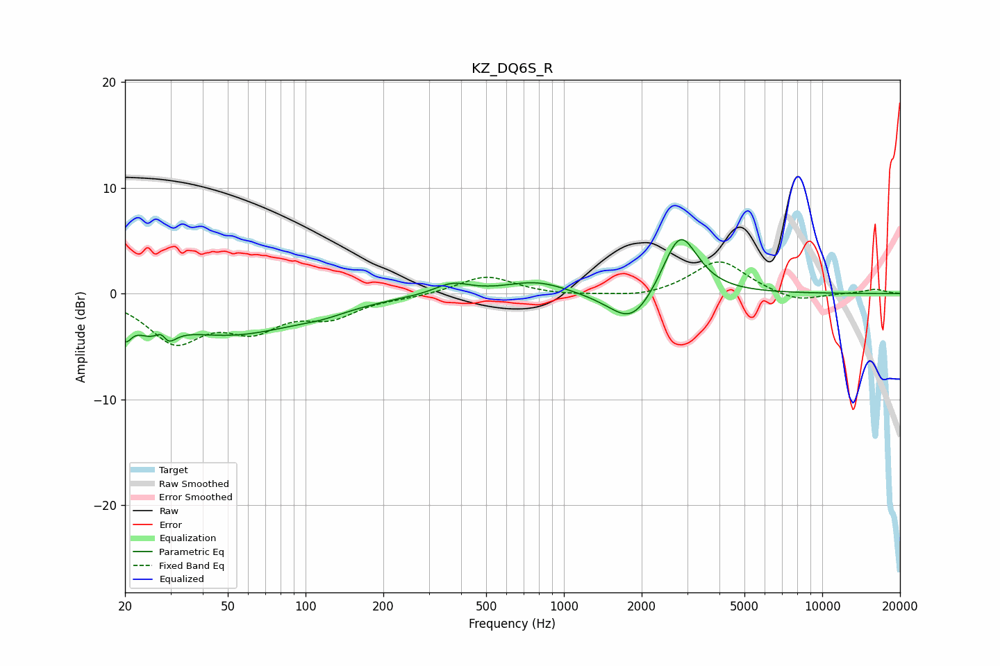

# KZ_DQ6S_R
See [usage instructions](https://github.com/jaakkopasanen/AutoEq#usage) for more options and info.

### Parametric EQs
Apply preamp of -5.2 dB when using parametric equalizer.

|   # | Type    |   Fc (Hz) |    Q |   Gain (dB) |
|-----|---------|-----------|------|-------------|
|   1 | Peaking |        20 | 5.54 |        -2.3 |
|   2 | Peaking |        24 | 3.51 |        -0.8 |
|   3 | Peaking |        28 | 5.95 |         3   |
|   4 | Peaking |        28 | 4.55 |        -3.7 |
|   5 | Peaking |        50 | 0.5  |        -3.8 |
|   6 | Peaking |       117 | 1.44 |        -0.5 |
|   7 | Peaking |       369 | 2.05 |         1.1 |
|   8 | Peaking |       783 | 1.19 |         1.2 |
|   9 | Peaking |      1839 | 1.59 |        -3.4 |
|  10 | Peaking |      2815 | 2.07 |         6.1 |

### Fixed Band EQs
When using fixed band (also called graphic) equalizer, apply preamp of **-3.1 dB** (if available) and set gains manually with these parameters.

|   # | Type    |   Fc (Hz) |    Q |   Gain (dB) |
|-----|---------|-----------|------|-------------|
|   1 | Peaking |        31 | 1.41 |        -4.3 |
|   2 | Peaking |        62 | 1.41 |        -2.9 |
|   3 | Peaking |       125 | 1.41 |        -1.9 |
|   4 | Peaking |       250 | 1.41 |        -0.2 |
|   5 | Peaking |       500 | 1.41 |         1.7 |
|   6 | Peaking |      1000 | 1.41 |        -0.2 |
|   7 | Peaking |      2000 | 1.41 |        -0.4 |
|   8 | Peaking |      4000 | 1.41 |         3.2 |
|   9 | Peaking |      8000 | 1.41 |        -0.9 |
|  10 | Peaking |     16000 | 1.41 |         0.4 |

### Graphs

