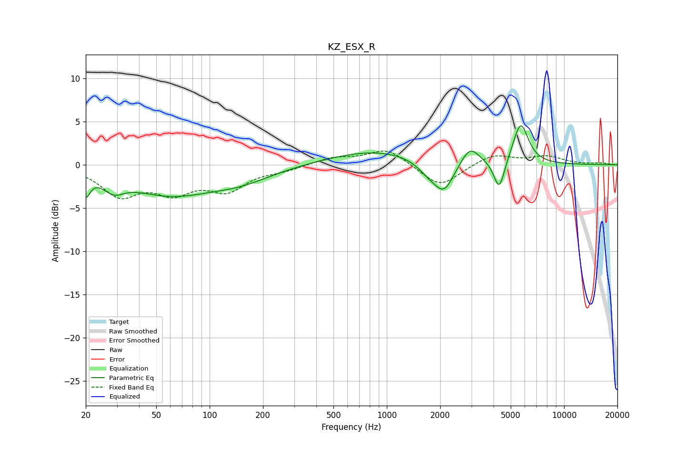

# KZ_ESX_R
See [usage instructions](https://github.com/jaakkopasanen/AutoEq#usage) for more options and info.

### Parametric EQs
Apply preamp of -4.6 dB when using parametric equalizer.

|   # | Type    |   Fc (Hz) |    Q |   Gain (dB) |
|-----|---------|-----------|------|-------------|
|   1 | Peaking |        20 | 5.82 |        -2.4 |
|   2 | Peaking |        29 | 2.36 |        -1.6 |
|   3 | Peaking |        59 | 0.59 |        -3.2 |
|   4 | Peaking |       150 | 0.77 |        -1.4 |
|   5 | Peaking |       859 | 0.54 |         1.7 |
|   6 | Peaking |      1706 | 2.35 |        -1.1 |
|   7 | Peaking |      2100 | 2.47 |        -3.4 |
|   8 | Peaking |      2948 | 2.72 |         2.2 |
|   9 | Peaking |      4308 | 4.66 |        -3.6 |
|  10 | Peaking |      5691 | 3.21 |         4.8 |

### Fixed Band EQs
When using fixed band (also called graphic) equalizer, apply preamp of **-1.7 dB** (if available) and set gains manually with these parameters.

|   # | Type    |   Fc (Hz) |    Q |   Gain (dB) |
|-----|---------|-----------|------|-------------|
|   1 | Peaking |        31 | 1.41 |        -3.3 |
|   2 | Peaking |        62 | 1.41 |        -2.7 |
|   3 | Peaking |       125 | 1.41 |        -2.7 |
|   4 | Peaking |       250 | 1.41 |        -0.5 |
|   5 | Peaking |       500 | 1.41 |         0.8 |
|   6 | Peaking |      1000 | 1.41 |         1.9 |
|   7 | Peaking |      2000 | 1.41 |        -2.7 |
|   8 | Peaking |      4000 | 1.41 |         1.2 |
|   9 | Peaking |      8000 | 1.41 |         0.9 |
|  10 | Peaking |     16000 | 1.41 |         0.2 |

### Graphs

