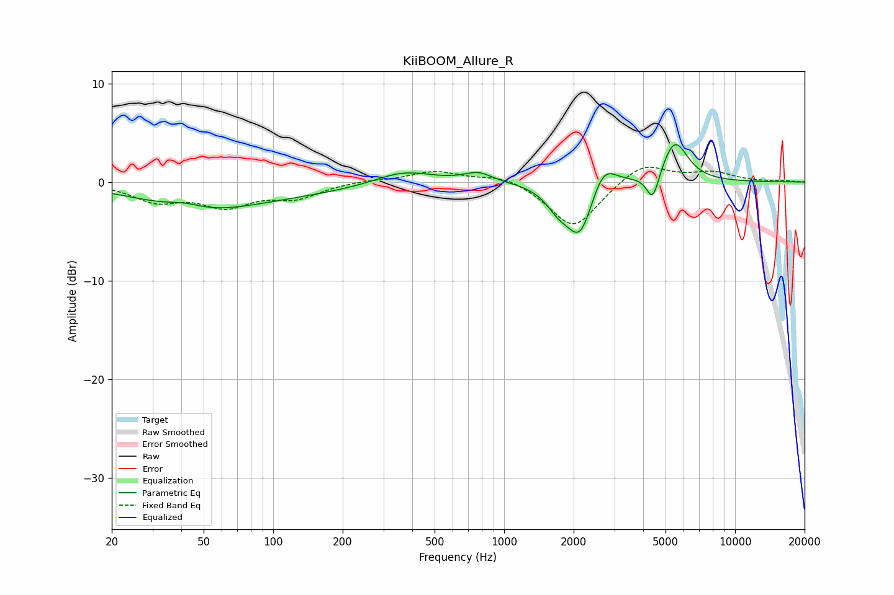

# KiiBOOM_Allure_R
See [usage instructions](https://github.com/jaakkopasanen/AutoEq#usage) for more options and info.

### Parametric EQs
Apply preamp of -3.9 dB when using parametric equalizer.

|   # | Type    |   Fc (Hz) |    Q |   Gain (dB) |
|-----|---------|-----------|------|-------------|
|   1 | Peaking |        41 | 1.86 |         0.6 |
|   2 | Peaking |        47 | 0.57 |        -2.4 |
|   3 | Peaking |       129 | 0.4  |        -0.9 |
|   4 | Peaking |       366 | 1.09 |         1.4 |
|   5 | Peaking |       772 | 2.34 |         1   |
|   6 | Peaking |      1719 | 2.62 |        -1.9 |
|   7 | Peaking |      2134 | 2.5  |        -5.3 |
|   8 | Peaking |      2688 | 2.62 |         2.8 |
|   9 | Peaking |      4407 | 5.15 |        -3   |
|  10 | Peaking |      5484 | 2.49 |         4.2 |

### Fixed Band EQs
When using fixed band (also called graphic) equalizer, apply preamp of **-1.6 dB** (if available) and set gains manually with these parameters.

|   # | Type    |   Fc (Hz) |    Q |   Gain (dB) |
|-----|---------|-----------|------|-------------|
|   1 | Peaking |        31 | 1.41 |        -1.8 |
|   2 | Peaking |        62 | 1.41 |        -2.2 |
|   3 | Peaking |       125 | 1.41 |        -1.4 |
|   4 | Peaking |       250 | 1.41 |         0.2 |
|   5 | Peaking |       500 | 1.41 |         1.1 |
|   6 | Peaking |      1000 | 1.41 |         0.8 |
|   7 | Peaking |      2000 | 1.41 |        -4.8 |
|   8 | Peaking |      4000 | 1.41 |         2.1 |
|   9 | Peaking |      8000 | 1.41 |         0.9 |
|  10 | Peaking |     16000 | 1.41 |         0.1 |

### Graphs

