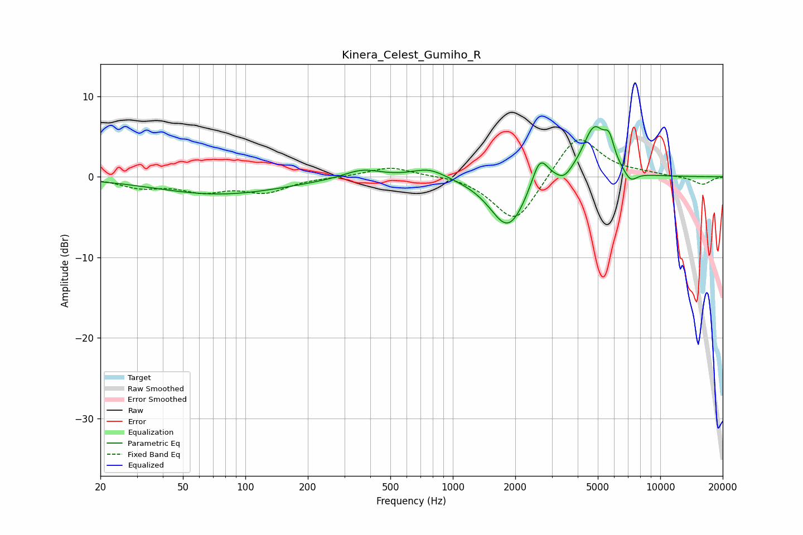

# Kinera_Celest_Gumiho_R
See [usage instructions](https://github.com/jaakkopasanen/AutoEq#usage) for more options and info.

### Parametric EQs
Apply preamp of -6.3 dB when using parametric equalizer.

|   # | Type    |   Fc (Hz) |    Q |   Gain (dB) |
|-----|---------|-----------|------|-------------|
|   1 | Peaking |        75 | 0.45 |        -2.2 |
|   2 | Peaking |       366 | 1.58 |         1.1 |
|   3 | Peaking |       770 | 1.71 |         1.2 |
|   4 | Peaking |      1803 | 1.83 |        -1.3 |
|   5 | Peaking |      1867 | 1.59 |        -5.2 |
|   6 | Peaking |      2626 | 3.49 |         3.9 |
|   7 | Peaking |      3443 | 3.97 |        -1   |
|   8 | Peaking |      4801 | 2.46 |         6.1 |
|   9 | Peaking |      5672 | 5.7  |         2.6 |
|  10 | Peaking |      7182 | 4.25 |        -1.4 |

### Fixed Band EQs
When using fixed band (also called graphic) equalizer, apply preamp of **-4.7 dB** (if available) and set gains manually with these parameters.

|   # | Type    |   Fc (Hz) |    Q |   Gain (dB) |
|-----|---------|-----------|------|-------------|
|   1 | Peaking |        31 | 1.41 |        -1.2 |
|   2 | Peaking |        62 | 1.41 |        -1.6 |
|   3 | Peaking |       125 | 1.41 |        -1.8 |
|   4 | Peaking |       250 | 1.41 |        -0   |
|   5 | Peaking |       500 | 1.41 |         1.2 |
|   6 | Peaking |      1000 | 1.41 |         0.3 |
|   7 | Peaking |      2000 | 1.41 |        -6   |
|   8 | Peaking |      4000 | 1.41 |         5.6 |
|   9 | Peaking |      8000 | 1.41 |         0.3 |
|  10 | Peaking |     16000 | 1.41 |        -1   |

### Graphs

