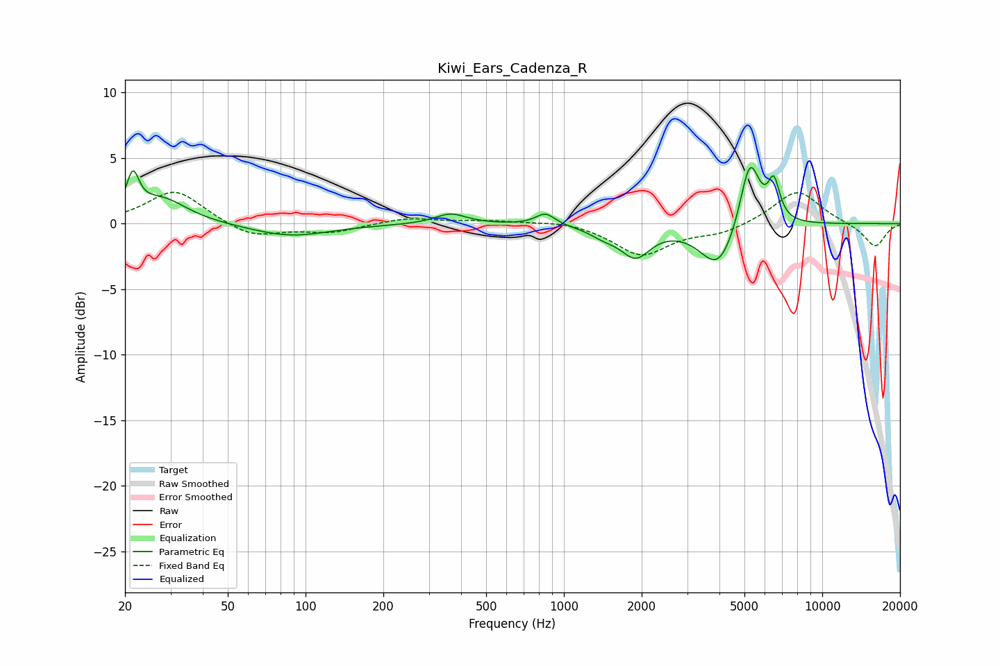

# Kiwi_Ears_Cadenza_R
See [usage instructions](https://github.com/jaakkopasanen/AutoEq#usage) for more options and info.

### Parametric EQs
Apply preamp of -4.4 dB when using parametric equalizer.

|   # | Type    |   Fc (Hz) |    Q |   Gain (dB) |
|-----|---------|-----------|------|-------------|
|   1 | Peaking |        21 | 6    |         2.9 |
|   2 | Peaking |        28 | 1.45 |         1.9 |
|   3 | Peaking |        87 | 0.93 |        -1   |
|   4 | Peaking |       364 | 2.33 |         0.8 |
|   5 | Peaking |       848 | 3.83 |         0.9 |
|   6 | Peaking |      1427 | 2.48 |        -0.6 |
|   7 | Peaking |      1895 | 2.46 |        -2.2 |
|   8 | Peaking |      3967 | 1.98 |        -3.5 |
|   9 | Peaking |      5245 | 3.56 |         5.4 |
|  10 | Peaking |      6499 | 6    |         2.9 |

### Fixed Band EQs
When using fixed band (also called graphic) equalizer, apply preamp of **-2.5 dB** (if available) and set gains manually with these parameters.

|   # | Type    |   Fc (Hz) |    Q |   Gain (dB) |
|-----|---------|-----------|------|-------------|
|   1 | Peaking |        31 | 1.41 |         2.6 |
|   2 | Peaking |        62 | 1.41 |        -1.1 |
|   3 | Peaking |       125 | 1.41 |        -0.6 |
|   4 | Peaking |       250 | 1.41 |         0.5 |
|   5 | Peaking |       500 | 1.41 |         0.2 |
|   6 | Peaking |      1000 | 1.41 |         0.3 |
|   7 | Peaking |      2000 | 1.41 |        -2.4 |
|   8 | Peaking |      4000 | 1.41 |        -0.7 |
|   9 | Peaking |      8000 | 1.41 |         2.6 |
|  10 | Peaking |     16000 | 1.41 |        -1.8 |

### Graphs

