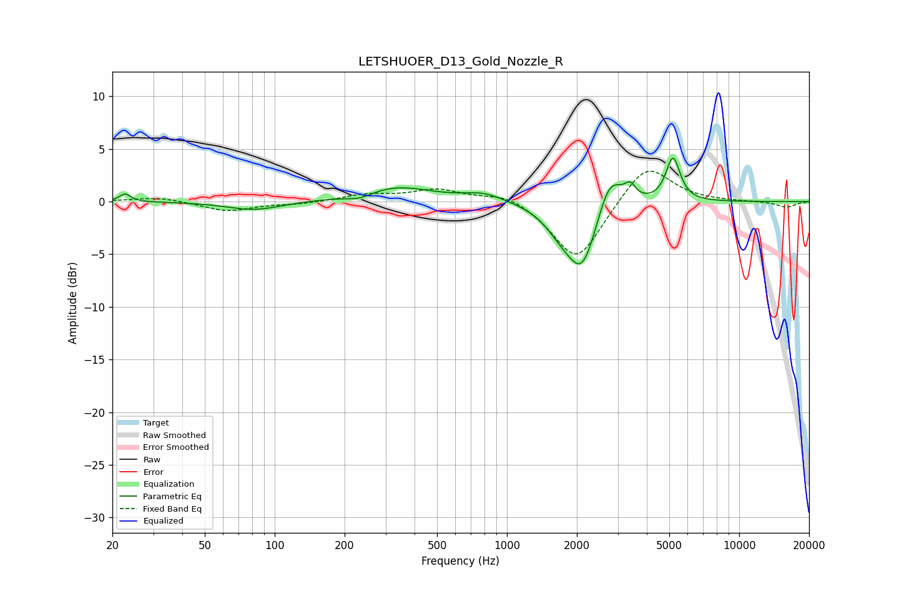

# LETSHUOER_D13_Gold_Nozzle_R
See [usage instructions](https://github.com/jaakkopasanen/AutoEq#usage) for more options and info.

### Parametric EQs
Apply preamp of -4.2 dB when using parametric equalizer.

|   # | Type    |   Fc (Hz) |    Q |   Gain (dB) |
|-----|---------|-----------|------|-------------|
|   1 | Peaking |        23 | 5.96 |         0.8 |
|   2 | Peaking |        81 | 1.21 |        -0.8 |
|   3 | Peaking |       231 | 2.42 |        -0.5 |
|   4 | Peaking |       333 | 0.92 |         1.4 |
|   5 | Peaking |       797 | 1.63 |         0.8 |
|   6 | Peaking |      1703 | 2.05 |        -1.7 |
|   7 | Peaking |      2112 | 2.19 |        -6.1 |
|   8 | Peaking |      2767 | 2.66 |         3.6 |
|   9 | Peaking |      3394 | 5.98 |         1.3 |
|  10 | Peaking |      5188 | 4.62 |         4.2 |

### Fixed Band EQs
When using fixed band (also called graphic) equalizer, apply preamp of **-3.0 dB** (if available) and set gains manually with these parameters.

|   # | Type    |   Fc (Hz) |    Q |   Gain (dB) |
|-----|---------|-----------|------|-------------|
|   1 | Peaking |        31 | 1.41 |         0.4 |
|   2 | Peaking |        62 | 1.41 |        -0.9 |
|   3 | Peaking |       125 | 1.41 |        -0.2 |
|   4 | Peaking |       250 | 1.41 |         0.6 |
|   5 | Peaking |       500 | 1.41 |         1.1 |
|   6 | Peaking |      1000 | 1.41 |         0.9 |
|   7 | Peaking |      2000 | 1.41 |        -5.8 |
|   8 | Peaking |      4000 | 1.41 |         3.8 |
|   9 | Peaking |      8000 | 1.41 |         0   |
|  10 | Peaking |     16000 | 1.41 |        -0.5 |

### Graphs

