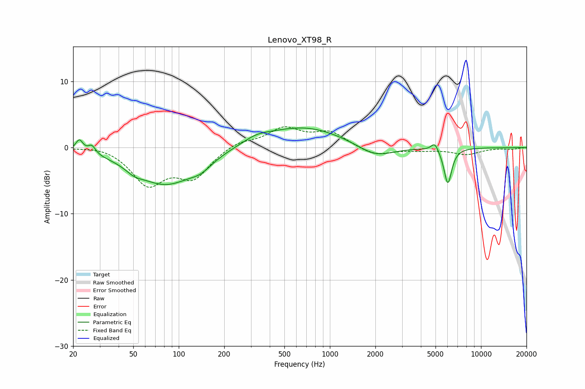

# Lenovo_XT98_R
See [usage instructions](https://github.com/jaakkopasanen/AutoEq#usage) for more options and info.

### Parametric EQs
Apply preamp of -3.1 dB when using parametric equalizer.

|   # | Type    |   Fc (Hz) |    Q |   Gain (dB) |
|-----|---------|-----------|------|-------------|
|   1 | Peaking |        22 | 5.95 |         1.8 |
|   2 | Peaking |        27 | 5.83 |         1.2 |
|   3 | Peaking |        51 | 2.64 |        -0.8 |
|   4 | Peaking |        82 | 0.72 |        -5.5 |
|   5 | Peaking |       140 | 1.93 |        -1.2 |
|   6 | Peaking |       326 | 1.63 |         0.8 |
|   7 | Peaking |       661 | 0.52 |         3.2 |
|   8 | Peaking |      1999 | 1.16 |        -1.9 |
|   9 | Peaking |      4946 | 5.95 |         1.3 |
|  10 | Peaking |      6035 | 5.38 |        -5.5 |

### Fixed Band EQs
When using fixed band (also called graphic) equalizer, apply preamp of **-3.2 dB** (if available) and set gains manually with these parameters.

|   # | Type    |   Fc (Hz) |    Q |   Gain (dB) |
|-----|---------|-----------|------|-------------|
|   1 | Peaking |        31 | 1.41 |         0.4 |
|   2 | Peaking |        62 | 1.41 |        -5.3 |
|   3 | Peaking |       125 | 1.41 |        -4.2 |
|   4 | Peaking |       250 | 1.41 |         1   |
|   5 | Peaking |       500 | 1.41 |         2.8 |
|   6 | Peaking |      1000 | 1.41 |         2.2 |
|   7 | Peaking |      2000 | 1.41 |        -1.3 |
|   8 | Peaking |      4000 | 1.41 |        -0.3 |
|   9 | Peaking |      8000 | 1.41 |        -1   |
|  10 | Peaking |     16000 | 1.41 |        -0.2 |

### Graphs

