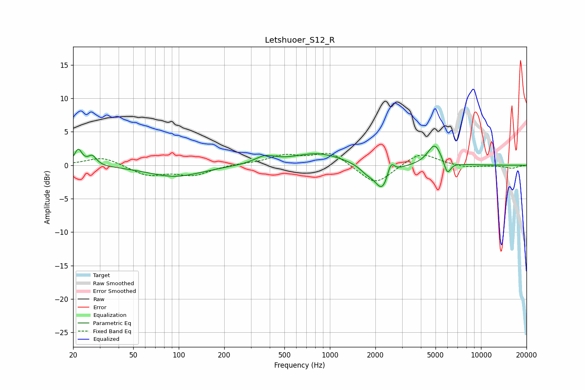

# Letshuoer_S12_R
See [usage instructions](https://github.com/jaakkopasanen/AutoEq#usage) for more options and info.

### Parametric EQs
Apply preamp of -3.0 dB when using parametric equalizer.

|   # | Type    |   Fc (Hz) |    Q |   Gain (dB) |
|-----|---------|-----------|------|-------------|
|   1 | Peaking |        22 | 5.73 |         2.3 |
|   2 | Peaking |        27 | 5.15 |         1.4 |
|   3 | Peaking |        94 | 0.8  |        -1.7 |
|   4 | Peaking |       372 | 2.07 |         1.1 |
|   5 | Peaking |       833 | 0.87 |         1.8 |
|   6 | Peaking |      1748 | 2.98 |        -0.9 |
|   7 | Peaking |      2232 | 2.81 |        -3.9 |
|   8 | Peaking |      2527 | 6    |         2.3 |
|   9 | Peaking |      4942 | 2.99 |         3.2 |
|  10 | Peaking |      5986 | 5.93 |        -2.1 |

### Fixed Band EQs
When using fixed band (also called graphic) equalizer, apply preamp of **-1.9 dB** (if available) and set gains manually with these parameters.

|   # | Type    |   Fc (Hz) |    Q |   Gain (dB) |
|-----|---------|-----------|------|-------------|
|   1 | Peaking |        31 | 1.41 |         1.3 |
|   2 | Peaking |        62 | 1.41 |        -1.5 |
|   3 | Peaking |       125 | 1.41 |        -1.4 |
|   4 | Peaking |       250 | 1.41 |         0.2 |
|   5 | Peaking |       500 | 1.41 |         1.4 |
|   6 | Peaking |      1000 | 1.41 |         2   |
|   7 | Peaking |      2000 | 1.41 |        -3.1 |
|   8 | Peaking |      4000 | 1.41 |         2   |
|   9 | Peaking |      8000 | 1.41 |        -0.4 |
|  10 | Peaking |     16000 | 1.41 |        -0.4 |

### Graphs

