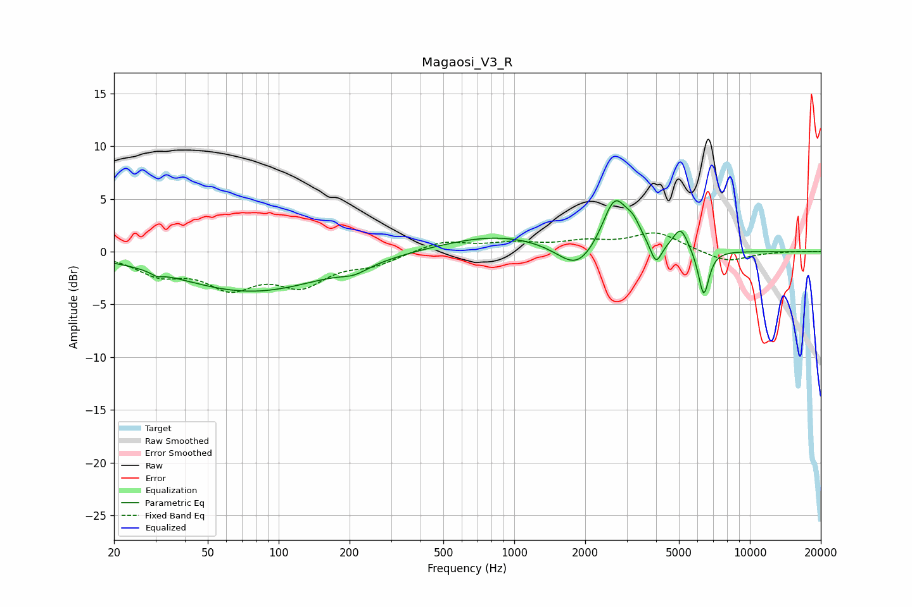

# Magaosi_V3_R
See [usage instructions](https://github.com/jaakkopasanen/AutoEq#usage) for more options and info.

### Parametric EQs
Apply preamp of -4.9 dB when using parametric equalizer.

|   # | Type    |   Fc (Hz) |    Q |   Gain (dB) |
|-----|---------|-----------|------|-------------|
|   1 | Peaking |        30 | 5.85 |        -0.4 |
|   2 | Peaking |        77 | 0.44 |        -3.8 |
|   3 | Peaking |       210 | 2.4  |        -0.7 |
|   4 | Peaking |       847 | 0.58 |         1.6 |
|   5 | Peaking |      1846 | 1.73 |        -2.5 |
|   6 | Peaking |      2667 | 2.68 |         4.9 |
|   7 | Peaking |      3197 | 4.17 |         1.4 |
|   8 | Peaking |      3995 | 6    |        -2.1 |
|   9 | Peaking |      5082 | 4.32 |         2.2 |
|  10 | Peaking |      6369 | 6    |        -4.4 |

### Fixed Band EQs
When using fixed band (also called graphic) equalizer, apply preamp of **-1.9 dB** (if available) and set gains manually with these parameters.

|   # | Type    |   Fc (Hz) |    Q |   Gain (dB) |
|-----|---------|-----------|------|-------------|
|   1 | Peaking |        31 | 1.41 |        -1.9 |
|   2 | Peaking |        62 | 1.41 |        -3   |
|   3 | Peaking |       125 | 1.41 |        -2.8 |
|   4 | Peaking |       250 | 1.41 |        -1   |
|   5 | Peaking |       500 | 1.41 |         1   |
|   6 | Peaking |      1000 | 1.41 |         0.7 |
|   7 | Peaking |      2000 | 1.41 |         0.8 |
|   8 | Peaking |      4000 | 1.41 |         1.8 |
|   9 | Peaking |      8000 | 1.41 |        -1   |
|  10 | Peaking |     16000 | 1.41 |         0   |

### Graphs

