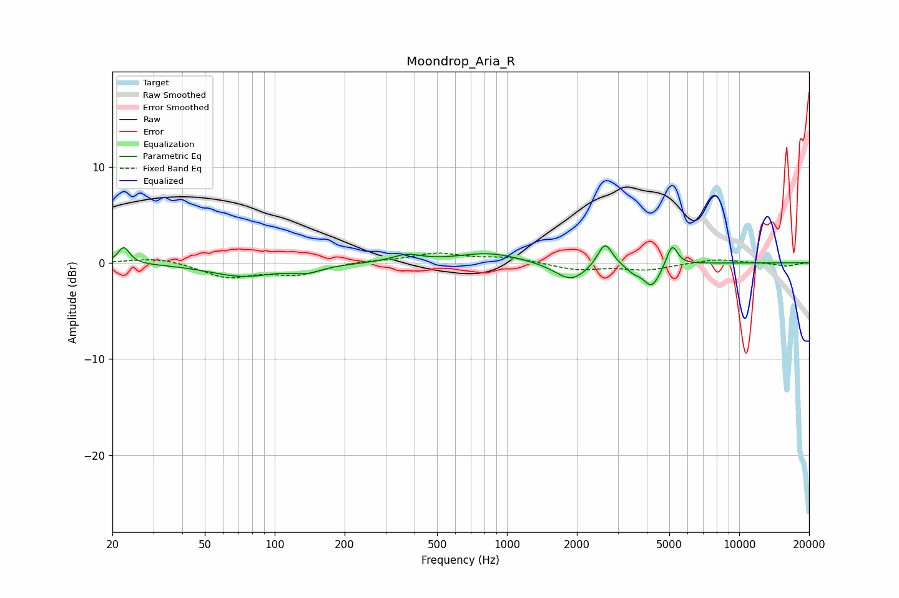

# Moondrop_Aria_R
See [usage instructions](https://github.com/jaakkopasanen/AutoEq#usage) for more options and info.

### Parametric EQs
Apply preamp of -1.9 dB when using parametric equalizer.

|   # | Type    |   Fc (Hz) |    Q |   Gain (dB) |
|-----|---------|-----------|------|-------------|
|   1 | Peaking |        22 | 5.82 |         1.7 |
|   2 | Peaking |        73 | 0.97 |        -1.4 |
|   3 | Peaking |       138 | 2.3  |        -0.7 |
|   4 | Peaking |       370 | 2.28 |         0.8 |
|   5 | Peaking |       837 | 1.06 |         1   |
|   6 | Peaking |      1887 | 2.03 |        -1.9 |
|   7 | Peaking |      2643 | 4.52 |         2.5 |
|   8 | Peaking |      3507 | 4.12 |        -0.7 |
|   9 | Peaking |      4208 | 3.89 |        -2.4 |
|  10 | Peaking |      5142 | 6    |         2.3 |

### Fixed Band EQs
When using fixed band (also called graphic) equalizer, apply preamp of **-1.1 dB** (if available) and set gains manually with these parameters.

|   # | Type    |   Fc (Hz) |    Q |   Gain (dB) |
|-----|---------|-----------|------|-------------|
|   1 | Peaking |        31 | 1.41 |         0.6 |
|   2 | Peaking |        62 | 1.41 |        -1.5 |
|   3 | Peaking |       125 | 1.41 |        -1.1 |
|   4 | Peaking |       250 | 1.41 |         0.2 |
|   5 | Peaking |       500 | 1.41 |         1   |
|   6 | Peaking |      1000 | 1.41 |         0.5 |
|   7 | Peaking |      2000 | 1.41 |        -0.7 |
|   8 | Peaking |      4000 | 1.41 |        -0.7 |
|   9 | Peaking |      8000 | 1.41 |         0.4 |
|  10 | Peaking |     16000 | 1.41 |        -0.4 |

### Graphs

