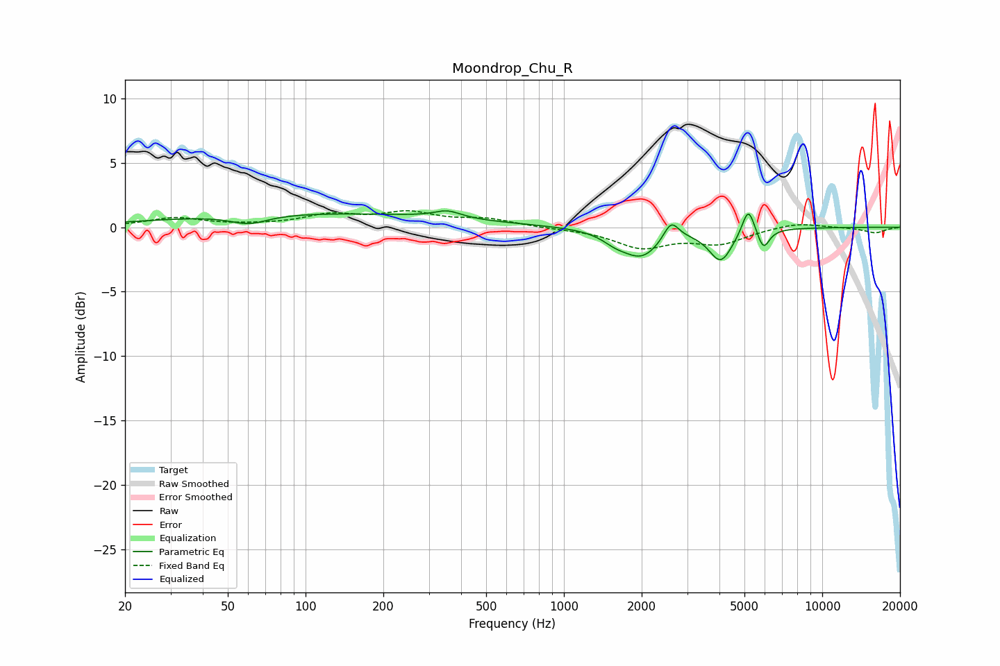

# Moondrop_Chu_R
See [usage instructions](https://github.com/jaakkopasanen/AutoEq#usage) for more options and info.

### Parametric EQs
Apply preamp of -1.4 dB when using parametric equalizer.

|   # | Type    |   Fc (Hz) |    Q |   Gain (dB) |
|-----|---------|-----------|------|-------------|
|   1 | Peaking |        60 | 1.96 |        -0.7 |
|   2 | Peaking |       107 | 0.24 |         1.1 |
|   3 | Peaking |       238 | 3.22 |         0   |
|   4 | Peaking |       354 | 2.7  |         0.6 |
|   5 | Peaking |      1578 | 2.87 |        -0.6 |
|   6 | Peaking |      2000 | 1.89 |        -2.2 |
|   7 | Peaking |      2601 | 4.82 |         1.5 |
|   8 | Peaking |      4047 | 3.11 |        -2.5 |
|   9 | Peaking |      5175 | 5.96 |         2.2 |
|  10 | Peaking |      5920 | 6    |        -1.6 |

### Fixed Band EQs
When using fixed band (also called graphic) equalizer, apply preamp of **-1.4 dB** (if available) and set gains manually with these parameters.

|   # | Type    |   Fc (Hz) |    Q |   Gain (dB) |
|-----|---------|-----------|------|-------------|
|   1 | Peaking |        31 | 1.41 |         0.7 |
|   2 | Peaking |        62 | 1.41 |         0.1 |
|   3 | Peaking |       125 | 1.41 |         0.9 |
|   4 | Peaking |       250 | 1.41 |         1   |
|   5 | Peaking |       500 | 1.41 |         0.6 |
|   6 | Peaking |      1000 | 1.41 |        -0.1 |
|   7 | Peaking |      2000 | 1.41 |        -1.5 |
|   8 | Peaking |      4000 | 1.41 |        -1.2 |
|   9 | Peaking |      8000 | 1.41 |         0.4 |
|  10 | Peaking |     16000 | 1.41 |        -0.4 |

### Graphs

