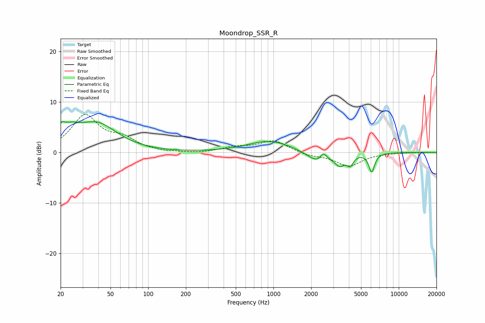

# Moondrop_SSR_R
See [usage instructions](https://github.com/jaakkopasanen/AutoEq#usage) for more options and info.

### Parametric EQs
Apply preamp of -6.2 dB when using parametric equalizer.

|   # | Type    |   Fc (Hz) |    Q |   Gain (dB) |
|-----|---------|-----------|------|-------------|
|   1 | Peaking |        20 | 5.81 |         1.7 |
|   2 | Peaking |        23 | 1.84 |         2.7 |
|   3 | Peaking |        39 | 0.89 |         5.4 |
|   4 | Peaking |       930 | 0.82 |         2.3 |
|   5 | Peaking |      2205 | 2.44 |         0.2 |
|   6 | Peaking |      2238 | 1.87 |        -2.4 |
|   7 | Peaking |      2502 | 5.75 |         1.5 |
|   8 | Peaking |      3377 | 3.33 |        -2.2 |
|   9 | Peaking |      4099 | 5.67 |        -1.8 |
|  10 | Peaking |      6080 | 5.98 |        -3.7 |

### Fixed Band EQs
When using fixed band (also called graphic) equalizer, apply preamp of **-7.6 dB** (if available) and set gains manually with these parameters.

|   # | Type    |   Fc (Hz) |    Q |   Gain (dB) |
|-----|---------|-----------|------|-------------|
|   1 | Peaking |        31 | 1.41 |         7.1 |
|   2 | Peaking |        62 | 1.41 |         2.3 |
|   3 | Peaking |       125 | 1.41 |        -0.1 |
|   4 | Peaking |       250 | 1.41 |        -0.2 |
|   5 | Peaking |       500 | 1.41 |         0.9 |
|   6 | Peaking |      1000 | 1.41 |         2.3 |
|   7 | Peaking |      2000 | 1.41 |        -0.6 |
|   8 | Peaking |      4000 | 1.41 |        -2.7 |
|   9 | Peaking |      8000 | 1.41 |        -0.1 |
|  10 | Peaking |     16000 | 1.41 |        -0   |

### Graphs

