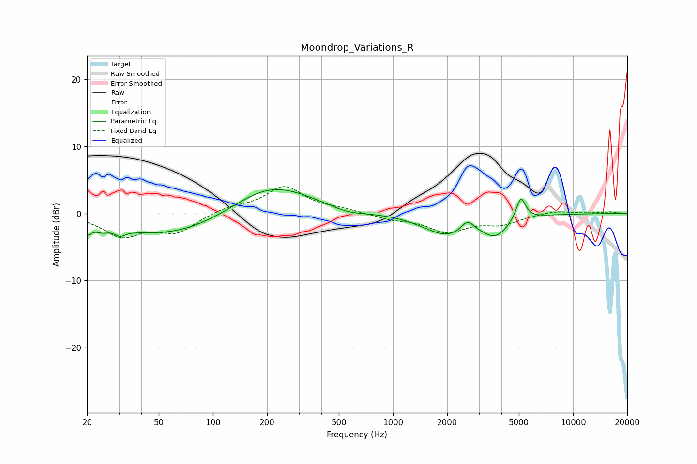

# Moondrop_Variations_R
See [usage instructions](https://github.com/jaakkopasanen/AutoEq#usage) for more options and info.

### Parametric EQs
Apply preamp of -3.6 dB when using parametric equalizer.

|   # | Type    |   Fc (Hz) |    Q |   Gain (dB) |
|-----|---------|-----------|------|-------------|
|   1 | Peaking |        20 | 5.93 |        -1.5 |
|   2 | Peaking |        24 | 4.5  |        -0.6 |
|   3 | Peaking |        31 | 4.96 |        -0.9 |
|   4 | Peaking |        63 | 0.38 |        -3.7 |
|   5 | Peaking |       204 | 0.61 |         5.2 |
|   6 | Peaking |       557 | 1.37 |        -0.8 |
|   7 | Peaking |      1994 | 1.07 |        -3.1 |
|   8 | Peaking |      2586 | 3.83 |         1.8 |
|   9 | Peaking |      3714 | 1.93 |        -2.7 |
|  10 | Peaking |      5127 | 5.33 |         3.5 |

### Fixed Band EQs
When using fixed band (also called graphic) equalizer, apply preamp of **-4.1 dB** (if available) and set gains manually with these parameters.

|   # | Type    |   Fc (Hz) |    Q |   Gain (dB) |
|-----|---------|-----------|------|-------------|
|   1 | Peaking |        31 | 1.41 |        -3.2 |
|   2 | Peaking |        62 | 1.41 |        -2.7 |
|   3 | Peaking |       125 | 1.41 |         0.9 |
|   4 | Peaking |       250 | 1.41 |         3.9 |
|   5 | Peaking |       500 | 1.41 |         0.5 |
|   6 | Peaking |      1000 | 1.41 |        -0.8 |
|   7 | Peaking |      2000 | 1.41 |        -2.6 |
|   8 | Peaking |      4000 | 1.41 |        -1.4 |
|   9 | Peaking |      8000 | 1.41 |         0.5 |
|  10 | Peaking |     16000 | 1.41 |         0.2 |

### Graphs

