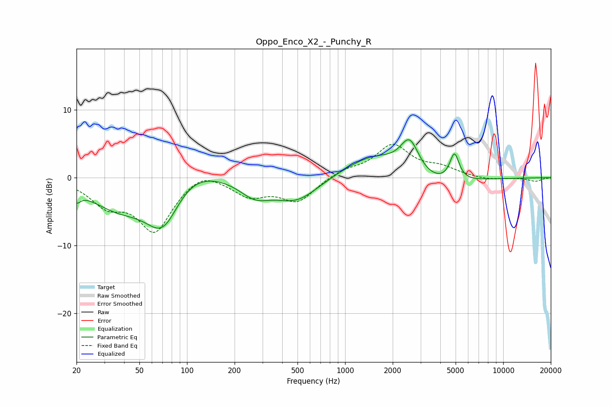

# Oppo_Enco_X2_-_Punchy_R
See [usage instructions](https://github.com/jaakkopasanen/AutoEq#usage) for more options and info.

### Parametric EQs
Apply preamp of -5.7 dB when using parametric equalizer.

|   # | Type    |   Fc (Hz) |    Q |   Gain (dB) |
|-----|---------|-----------|------|-------------|
|   1 | Peaking |        20 | 5.73 |        -1.5 |
|   2 | Peaking |        36 | 0.78 |        -3.8 |
|   3 | Peaking |        71 | 1.17 |        -8.5 |
|   4 | Peaking |        97 | 0.78 |         3.9 |
|   5 | Peaking |       269 | 1.44 |        -2.4 |
|   6 | Peaking |       494 | 1    |        -3.4 |
|   7 | Peaking |      1546 | 0.74 |         3.7 |
|   8 | Peaking |      2562 | 2.36 |         5.1 |
|   9 | Peaking |      3320 | 0.68 |        -2   |
|  10 | Peaking |      4916 | 4.79 |         4   |

### Fixed Band EQs
When using fixed band (also called graphic) equalizer, apply preamp of **-5.0 dB** (if available) and set gains manually with these parameters.

|   # | Type    |   Fc (Hz) |    Q |   Gain (dB) |
|-----|---------|-----------|------|-------------|
|   1 | Peaking |        31 | 1.41 |        -3.5 |
|   2 | Peaking |        62 | 1.41 |        -7.6 |
|   3 | Peaking |       125 | 1.41 |         1.6 |
|   4 | Peaking |       250 | 1.41 |        -2.5 |
|   5 | Peaking |       500 | 1.41 |        -3.4 |
|   6 | Peaking |      1000 | 1.41 |         1.1 |
|   7 | Peaking |      2000 | 1.41 |         4.7 |
|   8 | Peaking |      4000 | 1.41 |         1.2 |
|   9 | Peaking |      8000 | 1.41 |        -0.4 |
|  10 | Peaking |     16000 | 1.41 |        -0.5 |

### Graphs

