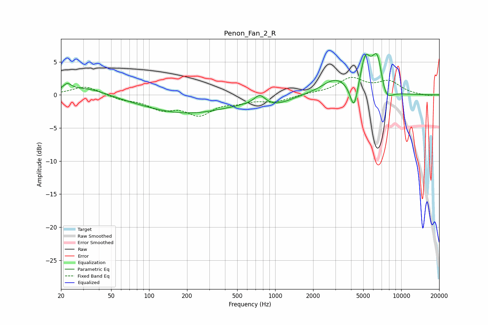

# Penon_Fan_2_R
See [usage instructions](https://github.com/jaakkopasanen/AutoEq#usage) for more options and info.

### Parametric EQs
Apply preamp of -6.4 dB when using parametric equalizer.

|   # | Type    |   Fc (Hz) |    Q |   Gain (dB) |
|-----|---------|-----------|------|-------------|
|   1 | Peaking |        22 | 4.15 |         1.1 |
|   2 | Peaking |        32 | 0.93 |         1.2 |
|   3 | Peaking |       198 | 0.41 |        -2.7 |
|   4 | Peaking |       755 | 3.35 |         1.4 |
|   5 | Peaking |      1014 | 1.21 |        -1.1 |
|   6 | Peaking |      3013 | 1.29 |         2.3 |
|   7 | Peaking |      4220 | 4.54 |        -4.2 |
|   8 | Peaking |      5182 | 3.62 |         4.7 |
|   9 | Peaking |      6459 | 3.04 |         6.3 |
|  10 | Peaking |      7467 | 2.74 |        -2.9 |

### Fixed Band EQs
When using fixed band (also called graphic) equalizer, apply preamp of **-2.7 dB** (if available) and set gains manually with these parameters.

|   # | Type    |   Fc (Hz) |    Q |   Gain (dB) |
|-----|---------|-----------|------|-------------|
|   1 | Peaking |        31 | 1.41 |         1.4 |
|   2 | Peaking |        62 | 1.41 |        -0.6 |
|   3 | Peaking |       125 | 1.41 |        -1.9 |
|   4 | Peaking |       250 | 1.41 |        -2.7 |
|   5 | Peaking |       500 | 1.41 |        -0.8 |
|   6 | Peaking |      1000 | 1.41 |        -0.9 |
|   7 | Peaking |      2000 | 1.41 |         0.2 |
|   8 | Peaking |      4000 | 1.41 |         2.4 |
|   9 | Peaking |      8000 | 1.41 |         1.9 |
|  10 | Peaking |     16000 | 1.41 |        -0.2 |

### Graphs

