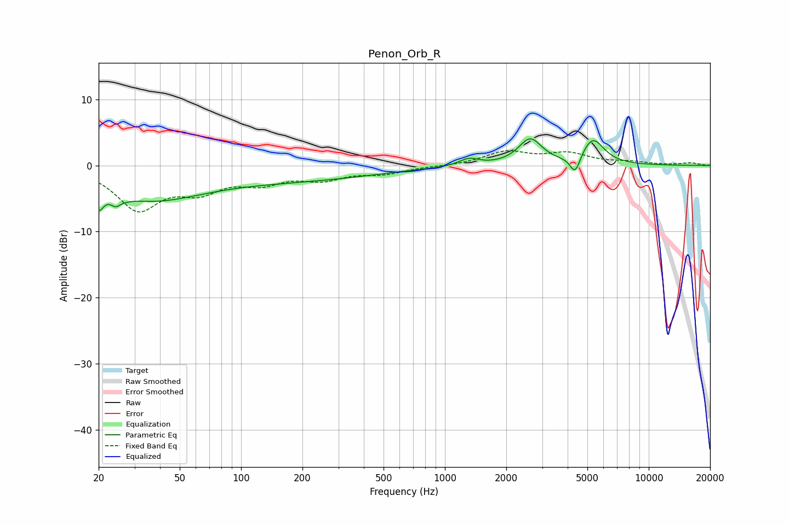

# Penon_Orb_R
See [usage instructions](https://github.com/jaakkopasanen/AutoEq#usage) for more options and info.

### Parametric EQs
Apply preamp of -4.1 dB when using parametric equalizer.

|   # | Type    |   Fc (Hz) |    Q |   Gain (dB) |
|-----|---------|-----------|------|-------------|
|   1 | Peaking |        20 | 5.99 |        -3   |
|   2 | Peaking |        25 | 5.28 |        -4.7 |
|   3 | Peaking |        25 | 5.95 |         3.2 |
|   4 | Peaking |        36 | 0.53 |        -4.7 |
|   5 | Peaking |        36 | 1.57 |        -0.1 |
|   6 | Peaking |       193 | 0.36 |        -2   |
|   7 | Peaking |      1312 | 2.96 |         1.1 |
|   8 | Peaking |      2621 | 2.46 |         3.9 |
|   9 | Peaking |      4354 | 5.68 |        -2.8 |
|  10 | Peaking |      5319 | 2.55 |         3.9 |

### Fixed Band EQs
When using fixed band (also called graphic) equalizer, apply preamp of **-2.3 dB** (if available) and set gains manually with these parameters.

|   # | Type    |   Fc (Hz) |    Q |   Gain (dB) |
|-----|---------|-----------|------|-------------|
|   1 | Peaking |        31 | 1.41 |        -6.3 |
|   2 | Peaking |        62 | 1.41 |        -3.2 |
|   3 | Peaking |       125 | 1.41 |        -2.2 |
|   4 | Peaking |       250 | 1.41 |        -1.8 |
|   5 | Peaking |       500 | 1.41 |        -1.1 |
|   6 | Peaking |      1000 | 1.41 |        -0.1 |
|   7 | Peaking |      2000 | 1.41 |         2   |
|   8 | Peaking |      4000 | 1.41 |         1.7 |
|   9 | Peaking |      8000 | 1.41 |         0.4 |
|  10 | Peaking |     16000 | 1.41 |         0.4 |

### Graphs

