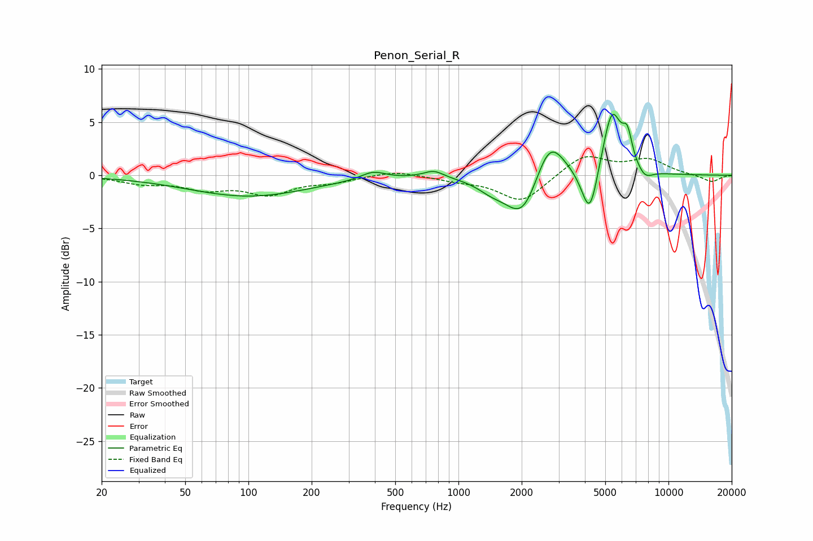

# Penon_Serial_R
See [usage instructions](https://github.com/jaakkopasanen/AutoEq#usage) for more options and info.

### Parametric EQs
Apply preamp of -5.8 dB when using parametric equalizer.

|   # | Type    |   Fc (Hz) |    Q |   Gain (dB) |
|-----|---------|-----------|------|-------------|
|   1 | Peaking |       100 | 0.49 |        -2   |
|   2 | Peaking |       392 | 2.47 |         0.8 |
|   3 | Peaking |       763 | 2.92 |         0.7 |
|   4 | Peaking |      1425 | 2.15 |        -0.8 |
|   5 | Peaking |      2029 | 1.68 |        -4.6 |
|   6 | Peaking |      2705 | 1.95 |         4.5 |
|   7 | Peaking |      4220 | 3.61 |        -4.9 |
|   8 | Peaking |      5378 | 3.01 |         6.2 |
|   9 | Peaking |      6372 | 5.97 |         2.6 |
|  10 | Peaking |      7719 | 3.65 |        -0.9 |

### Fixed Band EQs
When using fixed band (also called graphic) equalizer, apply preamp of **-1.8 dB** (if available) and set gains manually with these parameters.

|   # | Type    |   Fc (Hz) |    Q |   Gain (dB) |
|-----|---------|-----------|------|-------------|
|   1 | Peaking |        31 | 1.41 |        -0.7 |
|   2 | Peaking |        62 | 1.41 |        -1.1 |
|   3 | Peaking |       125 | 1.41 |        -1.6 |
|   4 | Peaking |       250 | 1.41 |        -0.5 |
|   5 | Peaking |       500 | 1.41 |         0.5 |
|   6 | Peaking |      1000 | 1.41 |        -0.4 |
|   7 | Peaking |      2000 | 1.41 |        -2.5 |
|   8 | Peaking |      4000 | 1.41 |         2   |
|   9 | Peaking |      8000 | 1.41 |         1.4 |
|  10 | Peaking |     16000 | 1.41 |        -0.7 |

### Graphs

