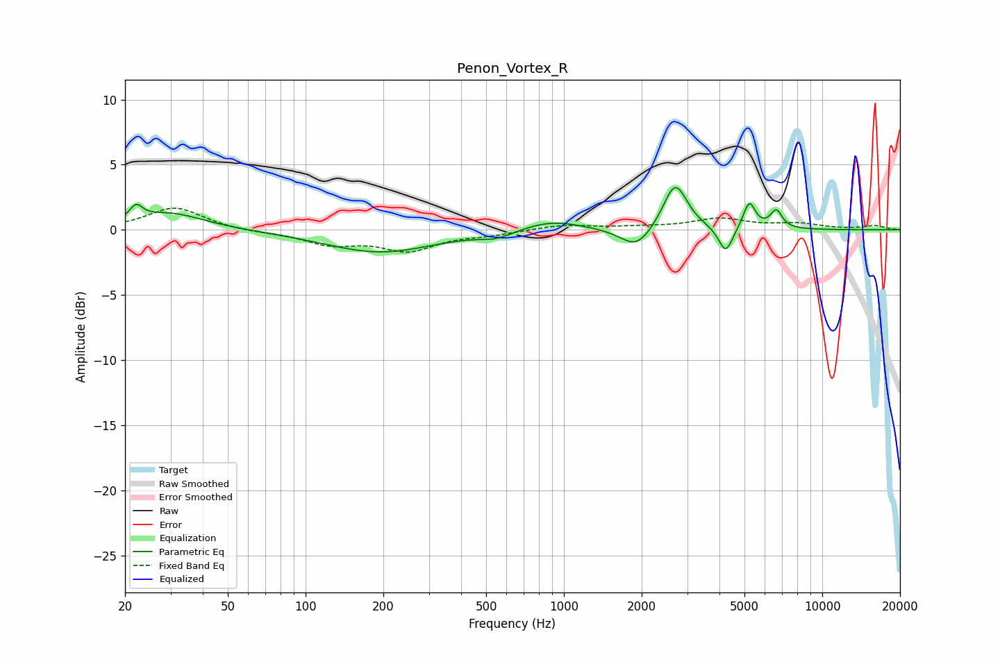

# Penon_Vortex_R
See [usage instructions](https://github.com/jaakkopasanen/AutoEq#usage) for more options and info.

### Parametric EQs
Apply preamp of -3.3 dB when using parametric equalizer.

|   # | Type    |   Fc (Hz) |    Q |   Gain (dB) |
|-----|---------|-----------|------|-------------|
|   1 | Peaking |        22 | 5.81 |         1.1 |
|   2 | Peaking |        30 | 1.05 |         1.3 |
|   3 | Peaking |       194 | 0.66 |        -1.7 |
|   4 | Peaking |       549 | 2.18 |        -0.5 |
|   5 | Peaking |       895 | 1.19 |         0.8 |
|   6 | Peaking |      1907 | 2.33 |        -1.6 |
|   7 | Peaking |      2696 | 3.05 |         3.7 |
|   8 | Peaking |      4229 | 5.14 |        -2   |
|   9 | Peaking |      5218 | 6    |         2.1 |
|  10 | Peaking |      6636 | 6    |         1.4 |

### Fixed Band EQs
When using fixed band (also called graphic) equalizer, apply preamp of **-1.8 dB** (if available) and set gains manually with these parameters.

|   # | Type    |   Fc (Hz) |    Q |   Gain (dB) |
|-----|---------|-----------|------|-------------|
|   1 | Peaking |        31 | 1.41 |         1.7 |
|   2 | Peaking |        62 | 1.41 |        -0.2 |
|   3 | Peaking |       125 | 1.41 |        -1   |
|   4 | Peaking |       250 | 1.41 |        -1.5 |
|   5 | Peaking |       500 | 1.41 |        -0.3 |
|   6 | Peaking |      1000 | 1.41 |         0.4 |
|   7 | Peaking |      2000 | 1.41 |         0.2 |
|   8 | Peaking |      4000 | 1.41 |         0.8 |
|   9 | Peaking |      8000 | 1.41 |         0.4 |
|  10 | Peaking |     16000 | 1.41 |         0.3 |

### Graphs

