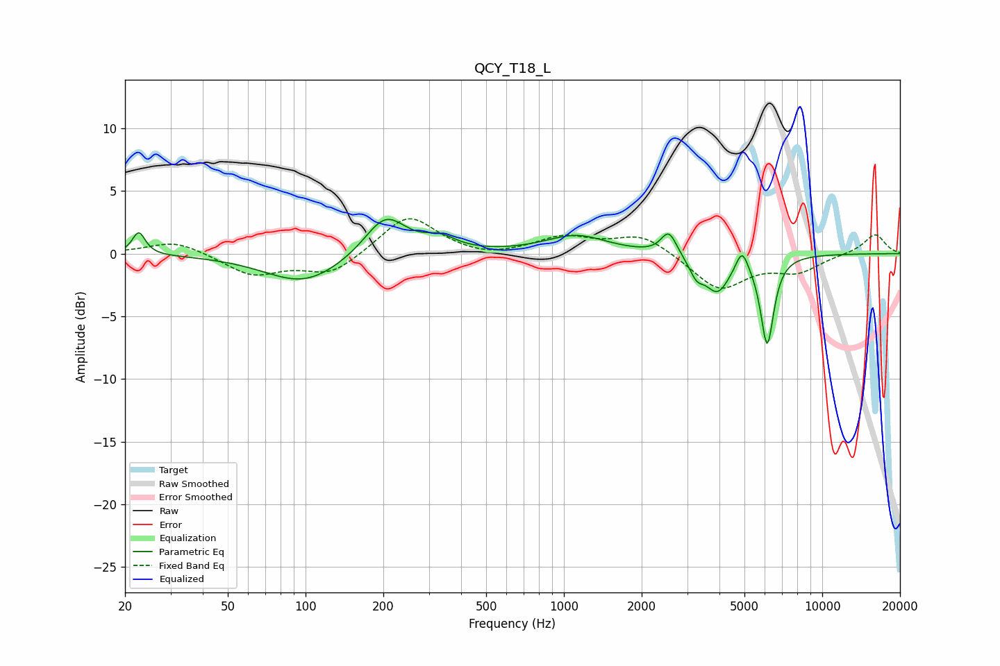

# QCY_T18_L
See [usage instructions](https://github.com/jaakkopasanen/AutoEq#usage) for more options and info.

### Parametric EQs
Apply preamp of -2.8 dB when using parametric equalizer.

|   # | Type    |   Fc (Hz) |    Q |   Gain (dB) |
|-----|---------|-----------|------|-------------|
|   1 | Peaking |        23 | 5.79 |         1.8 |
|   2 | Peaking |        99 | 0.93 |        -2.4 |
|   3 | Peaking |       204 | 1.75 |         3.3 |
|   4 | Peaking |       332 | 2.28 |         1   |
|   5 | Peaking |      1118 | 1.19 |         1.4 |
|   6 | Peaking |      2549 | 4.73 |         1.9 |
|   7 | Peaking |      3261 | 5.11 |        -1.3 |
|   8 | Peaking |      3929 | 2.87 |        -2.9 |
|   9 | Peaking |      4892 | 6    |         1.7 |
|  10 | Peaking |      6123 | 5.4  |        -7.1 |

### Fixed Band EQs
When using fixed band (also called graphic) equalizer, apply preamp of **-2.9 dB** (if available) and set gains manually with these parameters.

|   # | Type    |   Fc (Hz) |    Q |   Gain (dB) |
|-----|---------|-----------|------|-------------|
|   1 | Peaking |        31 | 1.41 |         1.1 |
|   2 | Peaking |        62 | 1.41 |        -1.7 |
|   3 | Peaking |       125 | 1.41 |        -1.7 |
|   4 | Peaking |       250 | 1.41 |         3.2 |
|   5 | Peaking |       500 | 1.41 |        -0.4 |
|   6 | Peaking |      1000 | 1.41 |         1.3 |
|   7 | Peaking |      2000 | 1.41 |         1.5 |
|   8 | Peaking |      4000 | 1.41 |        -2.9 |
|   9 | Peaking |      8000 | 1.41 |        -1.3 |
|  10 | Peaking |     16000 | 1.41 |         1.6 |

### Graphs

