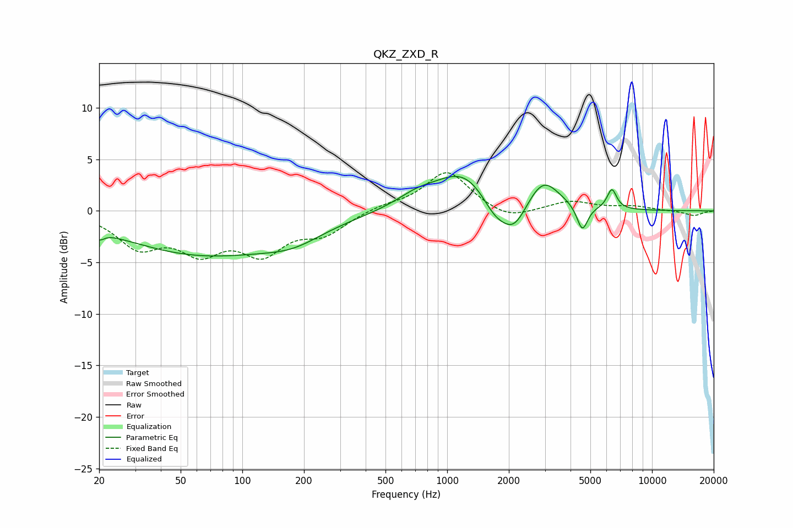

# QKZ_ZXD_R
See [usage instructions](https://github.com/jaakkopasanen/AutoEq#usage) for more options and info.

### Parametric EQs
Apply preamp of -3.4 dB when using parametric equalizer.

|   # | Type    |   Fc (Hz) |    Q |   Gain (dB) |
|-----|---------|-----------|------|-------------|
|   1 | Peaking |        20 | 5.97 |        -0.8 |
|   2 | Peaking |        65 | 0.35 |        -4.2 |
|   3 | Peaking |       177 | 0.98 |        -1.2 |
|   4 | Peaking |       711 | 1.36 |         1.1 |
|   5 | Peaking |      1202 | 1.03 |         3.7 |
|   6 | Peaking |      1701 | 2.24 |        -1.8 |
|   7 | Peaking |      2117 | 2.16 |        -3   |
|   8 | Peaking |      2940 | 1.81 |         3   |
|   9 | Peaking |      4568 | 5.32 |        -2.5 |
|  10 | Peaking |      6368 | 5.94 |         1.9 |

### Fixed Band EQs
When using fixed band (also called graphic) equalizer, apply preamp of **-3.8 dB** (if available) and set gains manually with these parameters.

|   # | Type    |   Fc (Hz) |    Q |   Gain (dB) |
|-----|---------|-----------|------|-------------|
|   1 | Peaking |        31 | 1.41 |        -3.2 |
|   2 | Peaking |        62 | 1.41 |        -3.4 |
|   3 | Peaking |       125 | 1.41 |        -3.6 |
|   4 | Peaking |       250 | 1.41 |        -2   |
|   5 | Peaking |       500 | 1.41 |         0.5 |
|   6 | Peaking |      1000 | 1.41 |         3.9 |
|   7 | Peaking |      2000 | 1.41 |        -1   |
|   8 | Peaking |      4000 | 1.41 |         0.9 |
|   9 | Peaking |      8000 | 1.41 |         0.4 |
|  10 | Peaking |     16000 | 1.41 |        -0.5 |

### Graphs

