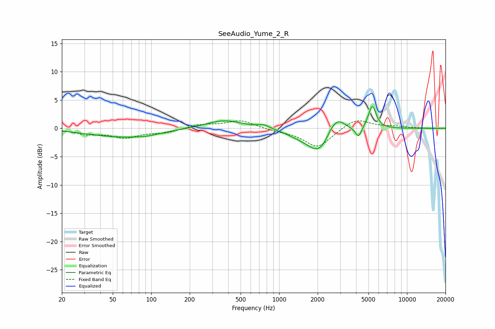

# SeeAudio_Yume_2_R
See [usage instructions](https://github.com/jaakkopasanen/AutoEq#usage) for more options and info.

### Parametric EQs
Apply preamp of -3.9 dB when using parametric equalizer.

|   # | Type    |   Fc (Hz) |    Q |   Gain (dB) |
|-----|---------|-----------|------|-------------|
|   1 | Peaking |        59 | 0.54 |        -1.5 |
|   2 | Peaking |        92 | 1.73 |        -0.3 |
|   3 | Peaking |       369 | 1    |         1.5 |
|   4 | Peaking |       760 | 2.92 |         0.6 |
|   5 | Peaking |      1492 | 1.24 |        -1.1 |
|   6 | Peaking |      2045 | 1.73 |        -3.6 |
|   7 | Peaking |      2567 | 3.77 |         0.8 |
|   8 | Peaking |      2901 | 2.58 |         2.3 |
|   9 | Peaking |      4174 | 5.97 |        -1.8 |
|  10 | Peaking |      5355 | 4.63 |         4.1 |

### Fixed Band EQs
When using fixed band (also called graphic) equalizer, apply preamp of **-1.4 dB** (if available) and set gains manually with these parameters.

|   # | Type    |   Fc (Hz) |    Q |   Gain (dB) |
|-----|---------|-----------|------|-------------|
|   1 | Peaking |        31 | 1.41 |        -0.9 |
|   2 | Peaking |        62 | 1.41 |        -1.5 |
|   3 | Peaking |       125 | 1.41 |        -0.7 |
|   4 | Peaking |       250 | 1.41 |         0.7 |
|   5 | Peaking |       500 | 1.41 |         1.4 |
|   6 | Peaking |      1000 | 1.41 |        -0.4 |
|   7 | Peaking |      2000 | 1.41 |        -3.4 |
|   8 | Peaking |      4000 | 1.41 |         1.8 |
|   9 | Peaking |      8000 | 1.41 |         0.3 |
|  10 | Peaking |     16000 | 1.41 |        -0   |

### Graphs

