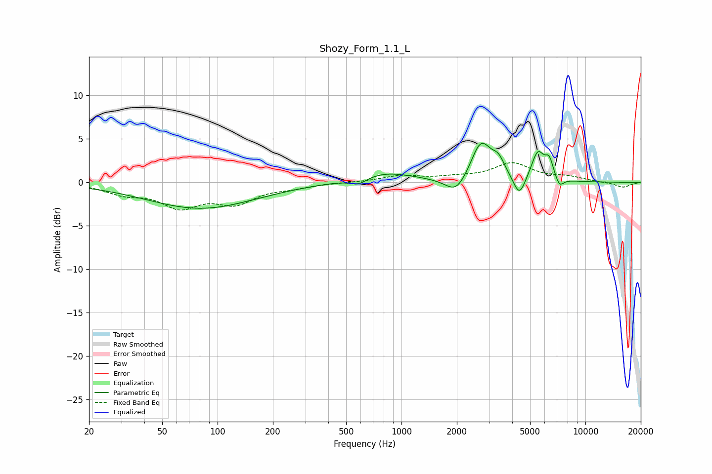

# Shozy_Form_1.1_L
See [usage instructions](https://github.com/jaakkopasanen/AutoEq#usage) for more options and info.

### Parametric EQs
Apply preamp of -4.6 dB when using parametric equalizer.

|   # | Type    |   Fc (Hz) |    Q |   Gain (dB) |
|-----|---------|-----------|------|-------------|
|   1 | Peaking |        81 | 0.48 |        -3   |
|   2 | Peaking |       584 | 3.08 |        -0.8 |
|   3 | Peaking |       813 | 0.91 |         1.2 |
|   4 | Peaking |      1987 | 2.43 |        -2   |
|   5 | Peaking |      2704 | 2.55 |         4.5 |
|   6 | Peaking |      3368 | 3.91 |         1.7 |
|   7 | Peaking |      4374 | 4.3  |        -2.5 |
|   8 | Peaking |      5512 | 3.93 |         3.3 |
|   9 | Peaking |      6360 | 6    |         2   |
|  10 | Peaking |      7227 | 5.95 |        -1.1 |

### Fixed Band EQs
When using fixed band (also called graphic) equalizer, apply preamp of **-2.4 dB** (if available) and set gains manually with these parameters.

|   # | Type    |   Fc (Hz) |    Q |   Gain (dB) |
|-----|---------|-----------|------|-------------|
|   1 | Peaking |        31 | 1.41 |        -1.1 |
|   2 | Peaking |        62 | 1.41 |        -2.6 |
|   3 | Peaking |       125 | 1.41 |        -2.1 |
|   4 | Peaking |       250 | 1.41 |        -0.5 |
|   5 | Peaking |       500 | 1.41 |        -0   |
|   6 | Peaking |      1000 | 1.41 |         0.7 |
|   7 | Peaking |      2000 | 1.41 |         0.4 |
|   8 | Peaking |      4000 | 1.41 |         2.1 |
|   9 | Peaking |      8000 | 1.41 |         0.5 |
|  10 | Peaking |     16000 | 1.41 |        -0.6 |

### Graphs

