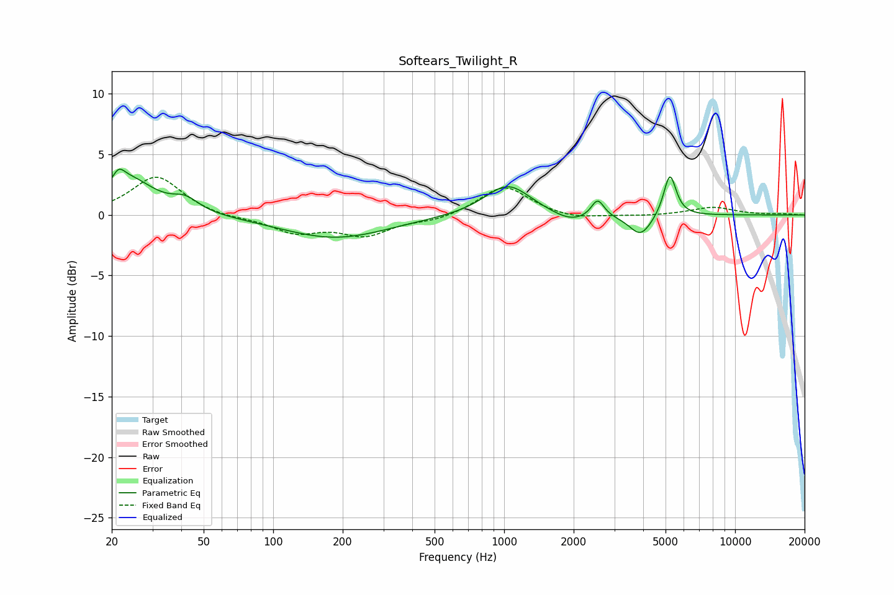

# Softears_Twilight_R
See [usage instructions](https://github.com/jaakkopasanen/AutoEq#usage) for more options and info.

### Parametric EQs
Apply preamp of -3.9 dB when using parametric equalizer.

|   # | Type    |   Fc (Hz) |    Q |   Gain (dB) |
|-----|---------|-----------|------|-------------|
|   1 | Peaking |        21 | 5.72 |         3.2 |
|   2 | Peaking |        22 | 6    |        -2.1 |
|   3 | Peaking |        24 | 1.32 |         2.8 |
|   4 | Peaking |        42 | 2.49 |         1   |
|   5 | Peaking |       185 | 0.61 |        -1.9 |
|   6 | Peaking |      1036 | 1.43 |         2.6 |
|   7 | Peaking |      1946 | 1.75 |        -0.8 |
|   8 | Peaking |      2541 | 5.18 |         1.5 |
|   9 | Peaking |      3903 | 2.87 |        -1.8 |
|  10 | Peaking |      5220 | 5.21 |         3.6 |

### Fixed Band EQs
When using fixed band (also called graphic) equalizer, apply preamp of **-3.2 dB** (if available) and set gains manually with these parameters.

|   # | Type    |   Fc (Hz) |    Q |   Gain (dB) |
|-----|---------|-----------|------|-------------|
|   1 | Peaking |        31 | 1.41 |         3.2 |
|   2 | Peaking |        62 | 1.41 |        -0.3 |
|   3 | Peaking |       125 | 1.41 |        -1.4 |
|   4 | Peaking |       250 | 1.41 |        -1.6 |
|   5 | Peaking |       500 | 1.41 |        -0.5 |
|   6 | Peaking |      1000 | 1.41 |         2.4 |
|   7 | Peaking |      2000 | 1.41 |        -0.4 |
|   8 | Peaking |      4000 | 1.41 |        -0.1 |
|   9 | Peaking |      8000 | 1.41 |         0.6 |
|  10 | Peaking |     16000 | 1.41 |         0.1 |

### Graphs

