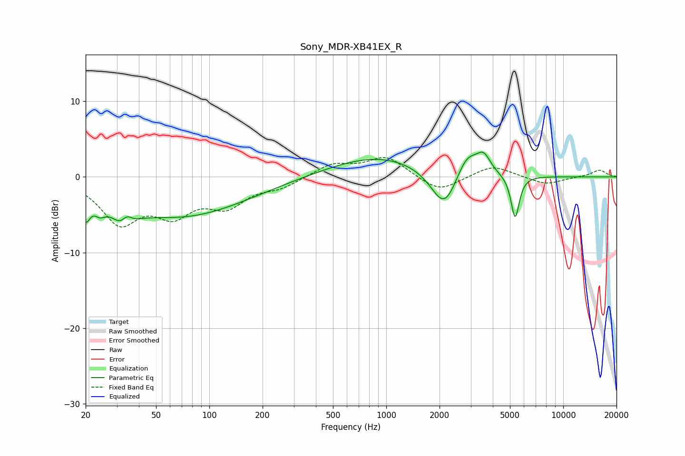

# Sony_MDR-XB41EX_R
See [usage instructions](https://github.com/jaakkopasanen/AutoEq#usage) for more options and info.

### Parametric EQs
Apply preamp of -3.4 dB when using parametric equalizer.

|   # | Type    |   Fc (Hz) |    Q |   Gain (dB) |
|-----|---------|-----------|------|-------------|
|   1 | Peaking |        20 | 5.86 |        -3   |
|   2 | Peaking |        24 | 4.43 |        -1.3 |
|   3 | Peaking |        33 | 2.74 |        -4.5 |
|   4 | Peaking |        34 | 4.05 |         3.3 |
|   5 | Peaking |        68 | 0.37 |        -5.2 |
|   6 | Peaking |       910 | 0.5  |         2.9 |
|   7 | Peaking |      2134 | 1.86 |        -5.6 |
|   8 | Peaking |      2856 | 2.23 |         3.4 |
|   9 | Peaking |      3553 | 3.66 |         2.2 |
|  10 | Peaking |      5348 | 6    |        -5.7 |

### Fixed Band EQs
When using fixed band (also called graphic) equalizer, apply preamp of **-2.7 dB** (if available) and set gains manually with these parameters.

|   # | Type    |   Fc (Hz) |    Q |   Gain (dB) |
|-----|---------|-----------|------|-------------|
|   1 | Peaking |        31 | 1.41 |        -5.7 |
|   2 | Peaking |        62 | 1.41 |        -4.2 |
|   3 | Peaking |       125 | 1.41 |        -3.4 |
|   4 | Peaking |       250 | 1.41 |        -1.2 |
|   5 | Peaking |       500 | 1.41 |         1.7 |
|   6 | Peaking |      1000 | 1.41 |         2.6 |
|   7 | Peaking |      2000 | 1.41 |        -2.1 |
|   8 | Peaking |      4000 | 1.41 |         1.6 |
|   9 | Peaking |      8000 | 1.41 |        -1   |
|  10 | Peaking |     16000 | 1.41 |         0.9 |

### Graphs

