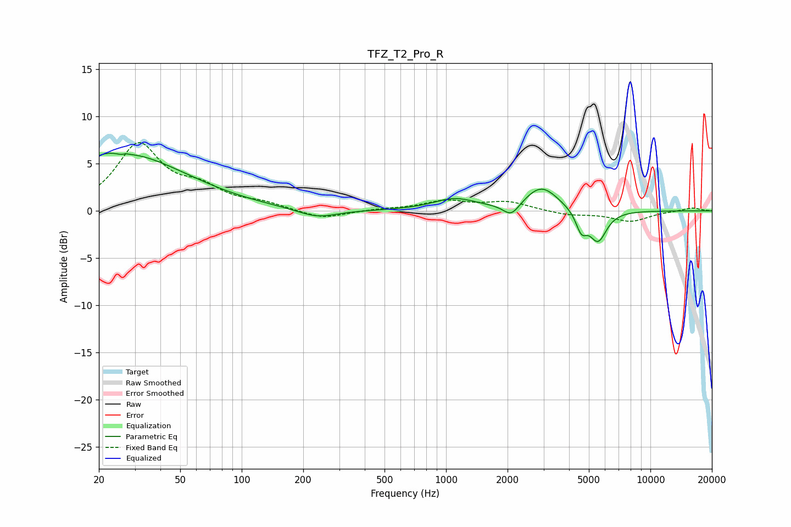

# TFZ_T2_Pro_R
See [usage instructions](https://github.com/jaakkopasanen/AutoEq#usage) for more options and info.

### Parametric EQs
Apply preamp of -6.2 dB when using parametric equalizer.

|   # | Type    |   Fc (Hz) |    Q |   Gain (dB) |
|-----|---------|-----------|------|-------------|
|   1 | Peaking |        21 | 1    |         1.5 |
|   2 | Peaking |        27 | 5.57 |        -3.4 |
|   3 | Peaking |        27 | 5.94 |         3.2 |
|   4 | Peaking |        29 | 0.47 |         5.1 |
|   5 | Peaking |       235 | 1.44 |        -0.9 |
|   6 | Peaking |      1101 | 1.35 |         1.2 |
|   7 | Peaking |      2088 | 3.48 |        -1.4 |
|   8 | Peaking |      2932 | 1.71 |         2.6 |
|   9 | Peaking |      4597 | 5.12 |        -2.1 |
|  10 | Peaking |      5543 | 3.29 |        -3.2 |

### Fixed Band EQs
When using fixed band (also called graphic) equalizer, apply preamp of **-7.3 dB** (if available) and set gains manually with these parameters.

|   # | Type    |   Fc (Hz) |    Q |   Gain (dB) |
|-----|---------|-----------|------|-------------|
|   1 | Peaking |        31 | 1.41 |         6.8 |
|   2 | Peaking |        62 | 1.41 |         2   |
|   3 | Peaking |       125 | 1.41 |         0.7 |
|   4 | Peaking |       250 | 1.41 |        -0.9 |
|   5 | Peaking |       500 | 1.41 |         0.2 |
|   6 | Peaking |      1000 | 1.41 |         1   |
|   7 | Peaking |      2000 | 1.41 |         0.9 |
|   8 | Peaking |      4000 | 1.41 |        -0.4 |
|   9 | Peaking |      8000 | 1.41 |        -1.1 |
|  10 | Peaking |     16000 | 1.41 |         0.3 |

### Graphs

