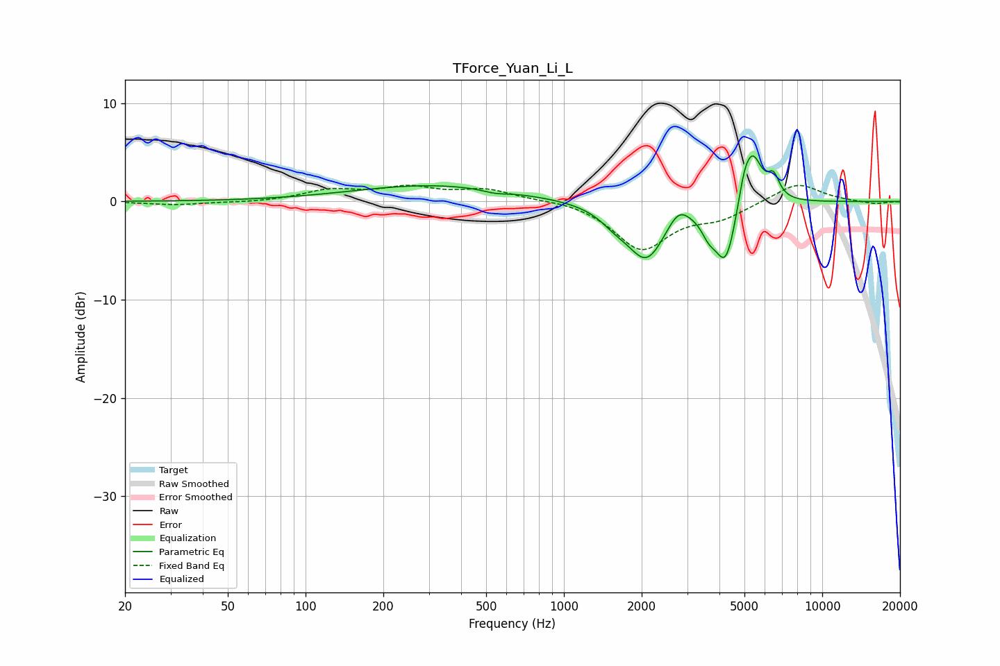

# TForce_Yuan_Li_L
See [usage instructions](https://github.com/jaakkopasanen/AutoEq#usage) for more options and info.

### Parametric EQs
Apply preamp of -4.7 dB when using parametric equalizer.

|   # | Type    |   Fc (Hz) |    Q |   Gain (dB) |
|-----|---------|-----------|------|-------------|
|   1 | Peaking |       314 | 0.46 |         1.7 |
|   2 | Peaking |       543 | 2.99 |        -0.3 |
|   3 | Peaking |      1577 | 2.39 |        -1.1 |
|   4 | Peaking |      2089 | 1.9  |        -5.6 |
|   5 | Peaking |      2775 | 3.41 |         1.7 |
|   6 | Peaking |      3634 | 5.05 |        -1.5 |
|   7 | Peaking |      4232 | 3.35 |        -6.3 |
|   8 | Peaking |      4982 | 5.96 |         1.9 |
|   9 | Peaking |      5372 | 3.59 |         5.3 |
|  10 | Peaking |      6481 | 6    |         2.1 |

### Fixed Band EQs
When using fixed band (also called graphic) equalizer, apply preamp of **-1.7 dB** (if available) and set gains manually with these parameters.

|   # | Type    |   Fc (Hz) |    Q |   Gain (dB) |
|-----|---------|-----------|------|-------------|
|   1 | Peaking |        31 | 1.41 |        -0.3 |
|   2 | Peaking |        62 | 1.41 |        -0.1 |
|   3 | Peaking |       125 | 1.41 |         1.1 |
|   4 | Peaking |       250 | 1.41 |         1.3 |
|   5 | Peaking |       500 | 1.41 |         1.1 |
|   6 | Peaking |      1000 | 1.41 |         0.3 |
|   7 | Peaking |      2000 | 1.41 |        -4.8 |
|   8 | Peaking |      4000 | 1.41 |        -1.4 |
|   9 | Peaking |      8000 | 1.41 |         2   |
|  10 | Peaking |     16000 | 1.41 |        -0.3 |

### Graphs

