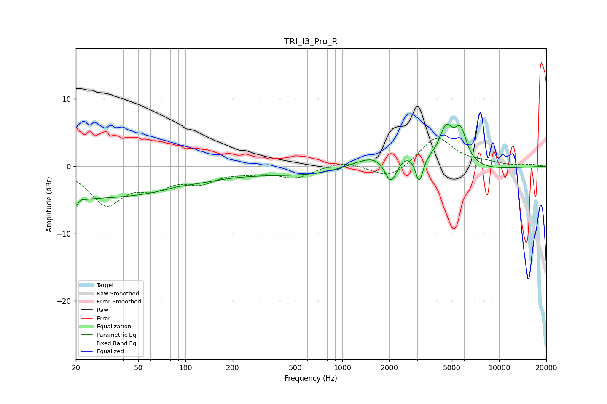

# TRI_I3_Pro_R
See [usage instructions](https://github.com/jaakkopasanen/AutoEq#usage) for more options and info.

### Parametric EQs
Apply preamp of -6.3 dB when using parametric equalizer.

|   # | Type    |   Fc (Hz) |    Q |   Gain (dB) |
|-----|---------|-----------|------|-------------|
|   1 | Peaking |        21 | 5.35 |        -3.8 |
|   2 | Peaking |        21 | 5.96 |         3   |
|   3 | Peaking |        24 | 0.19 |        -4.7 |
|   4 | Peaking |        89 | 1.81 |         0.3 |
|   5 | Peaking |      1772 | 0.21 |        -2.5 |
|   6 | Peaking |      2045 | 3.11 |        -5.2 |
|   7 | Peaking |      2136 | 0.68 |         5.7 |
|   8 | Peaking |      3095 | 5.74 |        -4.3 |
|   9 | Peaking |      4591 | 3.25 |         4.8 |
|  10 | Peaking |      5680 | 3.4  |         4.8 |

### Fixed Band EQs
When using fixed band (also called graphic) equalizer, apply preamp of **-4.3 dB** (if available) and set gains manually with these parameters.

|   # | Type    |   Fc (Hz) |    Q |   Gain (dB) |
|-----|---------|-----------|------|-------------|
|   1 | Peaking |        31 | 1.41 |        -5.4 |
|   2 | Peaking |        62 | 1.41 |        -2.5 |
|   3 | Peaking |       125 | 1.41 |        -2   |
|   4 | Peaking |       250 | 1.41 |        -0.6 |
|   5 | Peaking |       500 | 1.41 |        -1.6 |
|   6 | Peaking |      1000 | 1.41 |         0.9 |
|   7 | Peaking |      2000 | 1.41 |        -2   |
|   8 | Peaking |      4000 | 1.41 |         4.4 |
|   9 | Peaking |      8000 | 1.41 |         0.4 |
|  10 | Peaking |     16000 | 1.41 |         0.3 |

### Graphs

