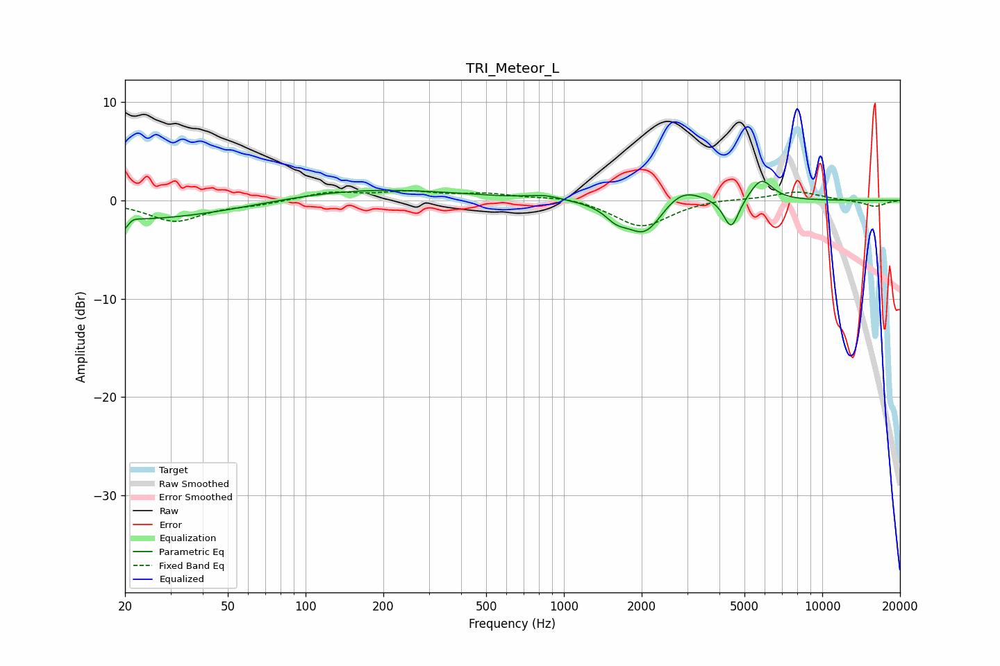

# TRI_Meteor_L
See [usage instructions](https://github.com/jaakkopasanen/AutoEq#usage) for more options and info.

### Parametric EQs
Apply preamp of -2.0 dB when using parametric equalizer.

|   # | Type    |   Fc (Hz) |    Q |   Gain (dB) |
|-----|---------|-----------|------|-------------|
|   1 | Peaking |        20 | 5.82 |        -2.2 |
|   2 | Peaking |        21 | 5.28 |         1.4 |
|   3 | Peaking |        22 | 0.27 |        -2.1 |
|   4 | Peaking |       147 | 0.36 |         1.4 |
|   5 | Peaking |       845 | 2.27 |         0.4 |
|   6 | Peaking |      1595 | 3.22 |        -1.2 |
|   7 | Peaking |      2061 | 2.02 |        -3.6 |
|   8 | Peaking |      2841 | 1.81 |         1.8 |
|   9 | Peaking |      4443 | 4.75 |        -3.2 |
|  10 | Peaking |      5807 | 3.16 |         2.2 |

### Fixed Band EQs
When using fixed band (also called graphic) equalizer, apply preamp of **-1.1 dB** (if available) and set gains manually with these parameters.

|   # | Type    |   Fc (Hz) |    Q |   Gain (dB) |
|-----|---------|-----------|------|-------------|
|   1 | Peaking |        31 | 1.41 |        -2.1 |
|   2 | Peaking |        62 | 1.41 |        -0.4 |
|   3 | Peaking |       125 | 1.41 |         0.8 |
|   4 | Peaking |       250 | 1.41 |         0.8 |
|   5 | Peaking |       500 | 1.41 |         0.6 |
|   6 | Peaking |      1000 | 1.41 |         0.4 |
|   7 | Peaking |      2000 | 1.41 |        -2.7 |
|   8 | Peaking |      4000 | 1.41 |         0.2 |
|   9 | Peaking |      8000 | 1.41 |         0.9 |
|  10 | Peaking |     16000 | 1.41 |        -0.6 |

### Graphs

