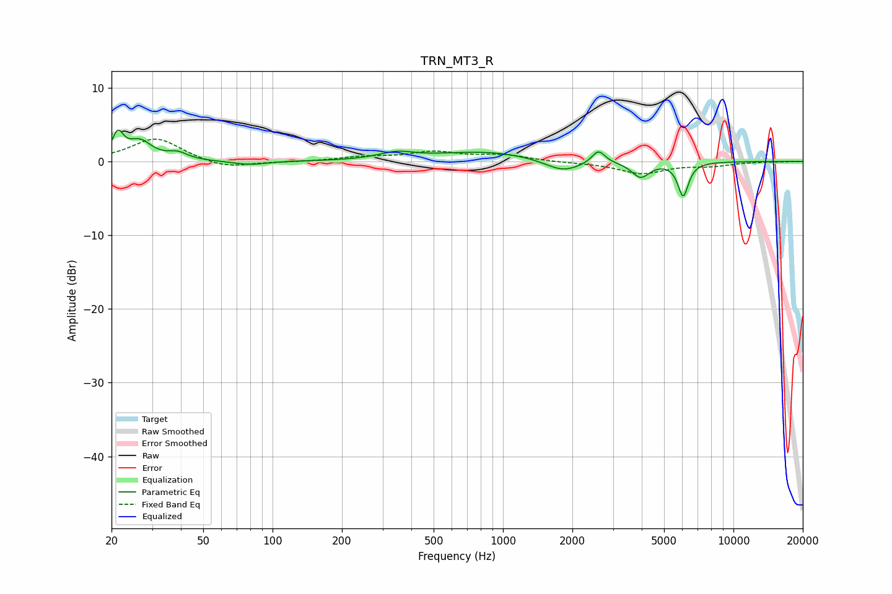

# TRN_MT3_R
See [usage instructions](https://github.com/jaakkopasanen/AutoEq#usage) for more options and info.

### Parametric EQs
Apply preamp of -4.3 dB when using parametric equalizer.

|   # | Type    |   Fc (Hz) |    Q |   Gain (dB) |
|-----|---------|-----------|------|-------------|
|   1 | Peaking |        21 | 5.99 |         3.1 |
|   2 | Peaking |        27 | 2.7  |         2.6 |
|   3 | Peaking |        39 | 3.38 |         0.9 |
|   4 | Peaking |        79 | 1.95 |        -0.5 |
|   5 | Peaking |       345 | 1.89 |         0.9 |
|   6 | Peaking |       839 | 0.65 |         1.3 |
|   7 | Peaking |      1820 | 1.79 |        -1.7 |
|   8 | Peaking |      2595 | 5.01 |         1.8 |
|   9 | Peaking |      3956 | 3.67 |        -2.1 |
|  10 | Peaking |      6051 | 6    |        -4.6 |

### Fixed Band EQs
When using fixed band (also called graphic) equalizer, apply preamp of **-3.1 dB** (if available) and set gains manually with these parameters.

|   # | Type    |   Fc (Hz) |    Q |   Gain (dB) |
|-----|---------|-----------|------|-------------|
|   1 | Peaking |        31 | 1.41 |         3.2 |
|   2 | Peaking |        62 | 1.41 |        -1   |
|   3 | Peaking |       125 | 1.41 |        -0.1 |
|   4 | Peaking |       250 | 1.41 |         0.5 |
|   5 | Peaking |       500 | 1.41 |         1.2 |
|   6 | Peaking |      1000 | 1.41 |         0.8 |
|   7 | Peaking |      2000 | 1.41 |        -0.1 |
|   8 | Peaking |      4000 | 1.41 |        -1.6 |
|   9 | Peaking |      8000 | 1.41 |        -0.5 |
|  10 | Peaking |     16000 | 1.41 |        -0   |

### Graphs

