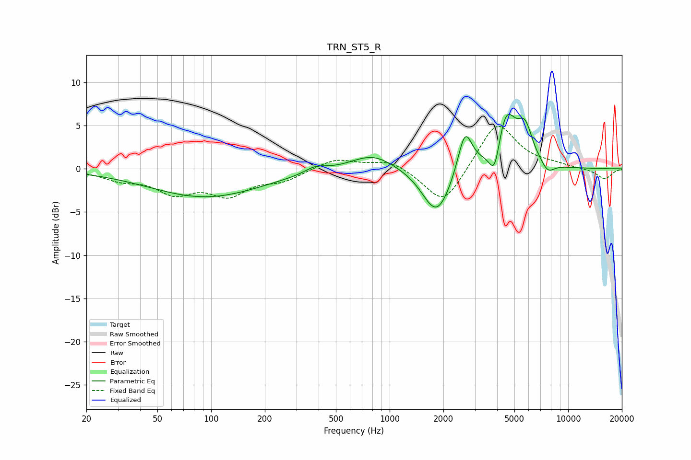

# TRN_ST5_R
See [usage instructions](https://github.com/jaakkopasanen/AutoEq#usage) for more options and info.

### Parametric EQs
Apply preamp of -6.4 dB when using parametric equalizer.

|   # | Type    |   Fc (Hz) |    Q |   Gain (dB) |
|-----|---------|-----------|------|-------------|
|   1 | Peaking |        93 | 0.45 |        -3.3 |
|   2 | Peaking |       384 | 2.43 |         0.7 |
|   3 | Peaking |       804 | 1.15 |         1.9 |
|   4 | Peaking |      1814 | 1.8  |        -4.5 |
|   5 | Peaking |      1966 | 1.74 |        -1.1 |
|   6 | Peaking |      2643 | 3.47 |         5   |
|   7 | Peaking |      3878 | 4.46 |        -4   |
|   8 | Peaking |      4470 | 2.46 |         6.6 |
|   9 | Peaking |      5739 | 3.26 |         3.8 |
|  10 | Peaking |      7686 | 3.62 |        -1.2 |

### Fixed Band EQs
When using fixed band (also called graphic) equalizer, apply preamp of **-5.0 dB** (if available) and set gains manually with these parameters.

|   # | Type    |   Fc (Hz) |    Q |   Gain (dB) |
|-----|---------|-----------|------|-------------|
|   1 | Peaking |        31 | 1.41 |        -1.1 |
|   2 | Peaking |        62 | 1.41 |        -2.5 |
|   3 | Peaking |       125 | 1.41 |        -2.7 |
|   4 | Peaking |       250 | 1.41 |        -1.2 |
|   5 | Peaking |       500 | 1.41 |         1.2 |
|   6 | Peaking |      1000 | 1.41 |         1.1 |
|   7 | Peaking |      2000 | 1.41 |        -4.4 |
|   8 | Peaking |      4000 | 1.41 |         5.6 |
|   9 | Peaking |      8000 | 1.41 |         0.4 |
|  10 | Peaking |     16000 | 1.41 |        -1.2 |

### Graphs

