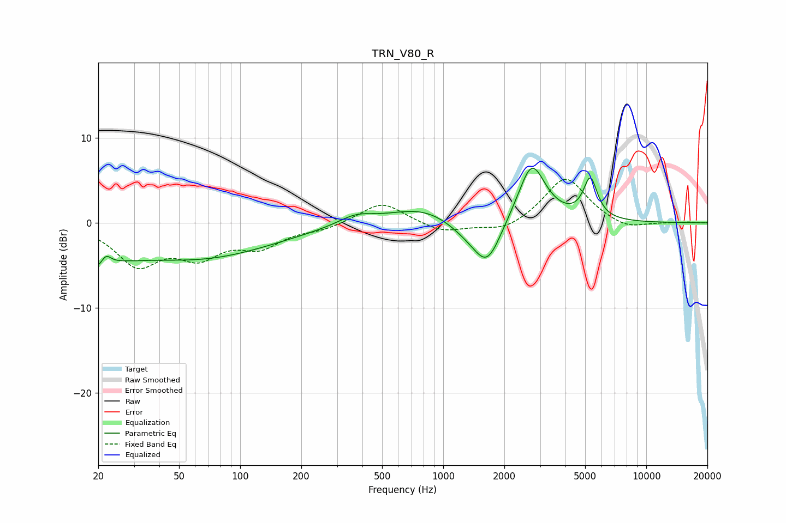

# TRN_V80_R
See [usage instructions](https://github.com/jaakkopasanen/AutoEq#usage) for more options and info.

### Parametric EQs
Apply preamp of -6.5 dB when using parametric equalizer.

|   # | Type    |   Fc (Hz) |    Q |   Gain (dB) |
|-----|---------|-----------|------|-------------|
|   1 | Peaking |        20 | 2.55 |        -4.2 |
|   2 | Peaking |        22 | 4.7  |         2.6 |
|   3 | Peaking |        29 | 1.29 |        -0.7 |
|   4 | Peaking |        60 | 0.38 |        -4.1 |
|   5 | Peaking |       371 | 1.59 |         1.1 |
|   6 | Peaking |       787 | 0.87 |         1.9 |
|   7 | Peaking |      1298 | 1.49 |        -1.1 |
|   8 | Peaking |      1646 | 2.02 |        -5.1 |
|   9 | Peaking |      2727 | 2.07 |         7.2 |
|  10 | Peaking |      5303 | 4.08 |         4.7 |

### Fixed Band EQs
When using fixed band (also called graphic) equalizer, apply preamp of **-5.2 dB** (if available) and set gains manually with these parameters.

|   # | Type    |   Fc (Hz) |    Q |   Gain (dB) |
|-----|---------|-----------|------|-------------|
|   1 | Peaking |        31 | 1.41 |        -4.7 |
|   2 | Peaking |        62 | 1.41 |        -3.4 |
|   3 | Peaking |       125 | 1.41 |        -2.5 |
|   4 | Peaking |       250 | 1.41 |        -0.7 |
|   5 | Peaking |       500 | 1.41 |         2.5 |
|   6 | Peaking |      1000 | 1.41 |        -1.2 |
|   7 | Peaking |      2000 | 1.41 |        -1.1 |
|   8 | Peaking |      4000 | 1.41 |         5.5 |
|   9 | Peaking |      8000 | 1.41 |        -0.9 |
|  10 | Peaking |     16000 | 1.41 |         0.1 |

### Graphs

