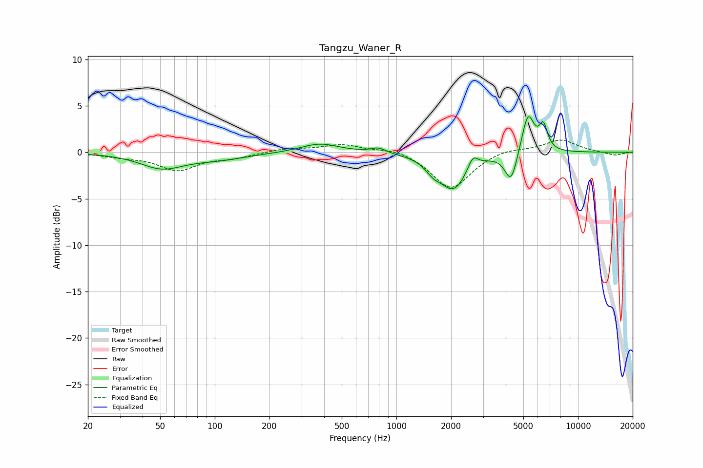

# Tangzu_Waner_R
See [usage instructions](https://github.com/jaakkopasanen/AutoEq#usage) for more options and info.

### Parametric EQs
Apply preamp of -3.9 dB when using parametric equalizer.

|   # | Type    |   Fc (Hz) |    Q |   Gain (dB) |
|-----|---------|-----------|------|-------------|
|   1 | Peaking |        51 | 1.2  |        -1.6 |
|   2 | Peaking |       105 | 0.86 |        -0.7 |
|   3 | Peaking |       379 | 1.34 |         1   |
|   4 | Peaking |       795 | 3.47 |         0.5 |
|   5 | Peaking |      1594 | 3.37 |        -0.9 |
|   6 | Peaking |      2065 | 1.84 |        -3.9 |
|   7 | Peaking |      2633 | 5.01 |         1.5 |
|   8 | Peaking |      4280 | 4.14 |        -3.3 |
|   9 | Peaking |      5301 | 4.01 |         4.4 |
|  10 | Peaking |      6443 | 6    |         2.5 |

### Fixed Band EQs
When using fixed band (also called graphic) equalizer, apply preamp of **-1.4 dB** (if available) and set gains manually with these parameters.

|   # | Type    |   Fc (Hz) |    Q |   Gain (dB) |
|-----|---------|-----------|------|-------------|
|   1 | Peaking |        31 | 1.41 |        -0.4 |
|   2 | Peaking |        62 | 1.41 |        -1.9 |
|   3 | Peaking |       125 | 1.41 |        -0.5 |
|   4 | Peaking |       250 | 1.41 |         0.4 |
|   5 | Peaking |       500 | 1.41 |         0.8 |
|   6 | Peaking |      1000 | 1.41 |         0.5 |
|   7 | Peaking |      2000 | 1.41 |        -4   |
|   8 | Peaking |      4000 | 1.41 |         0.5 |
|   9 | Peaking |      8000 | 1.41 |         1.4 |
|  10 | Peaking |     16000 | 1.41 |        -0.4 |

### Graphs

