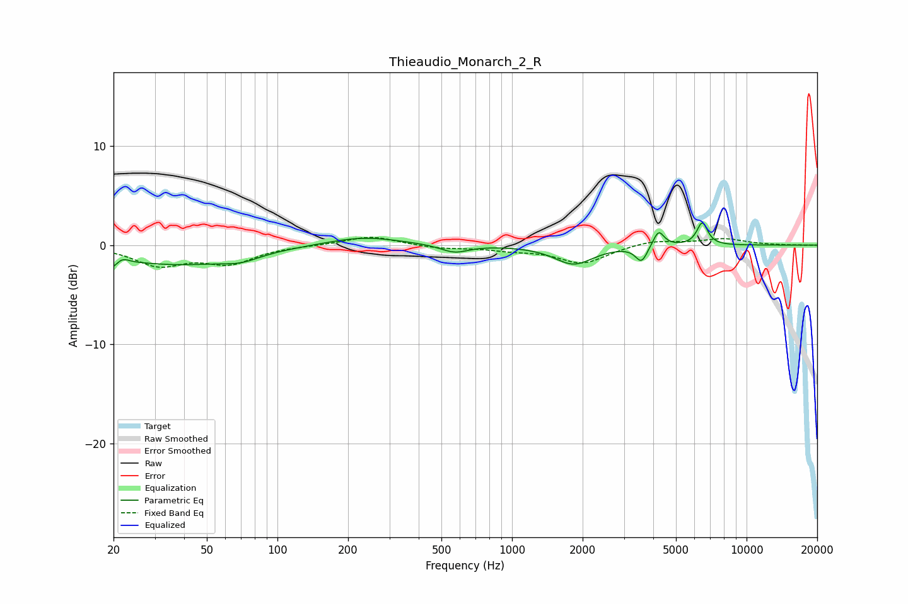

# Thieaudio_Monarch_2_R
See [usage instructions](https://github.com/jaakkopasanen/AutoEq#usage) for more options and info.

### Parametric EQs
Apply preamp of -2.4 dB when using parametric equalizer.

|   # | Type    |   Fc (Hz) |    Q |   Gain (dB) |
|-----|---------|-----------|------|-------------|
|   1 | Peaking |        20 | 2.93 |        -2.1 |
|   2 | Peaking |        21 | 4.19 |         1.5 |
|   3 | Peaking |        38 | 0.59 |        -1.8 |
|   4 | Peaking |        70 | 1.71 |        -0.7 |
|   5 | Peaking |       233 | 0.92 |         0.9 |
|   6 | Peaking |       568 | 2.4  |        -0.8 |
|   7 | Peaking |      1833 | 1.72 |        -1.9 |
|   8 | Peaking |      3566 | 5.66 |        -1.6 |
|   9 | Peaking |      4213 | 6    |         1.7 |
|  10 | Peaking |      6473 | 5.98 |         2.3 |

### Fixed Band EQs
When using fixed band (also called graphic) equalizer, apply preamp of **-0.9 dB** (if available) and set gains manually with these parameters.

|   # | Type    |   Fc (Hz) |    Q |   Gain (dB) |
|-----|---------|-----------|------|-------------|
|   1 | Peaking |        31 | 1.41 |        -1.9 |
|   2 | Peaking |        62 | 1.41 |        -1.7 |
|   3 | Peaking |       125 | 1.41 |        -0   |
|   4 | Peaking |       250 | 1.41 |         0.9 |
|   5 | Peaking |       500 | 1.41 |        -0.3 |
|   6 | Peaking |      1000 | 1.41 |        -0.4 |
|   7 | Peaking |      2000 | 1.41 |        -1.8 |
|   8 | Peaking |      4000 | 1.41 |         0.5 |
|   9 | Peaking |      8000 | 1.41 |         0.6 |
|  10 | Peaking |     16000 | 1.41 |        -0   |

### Graphs

