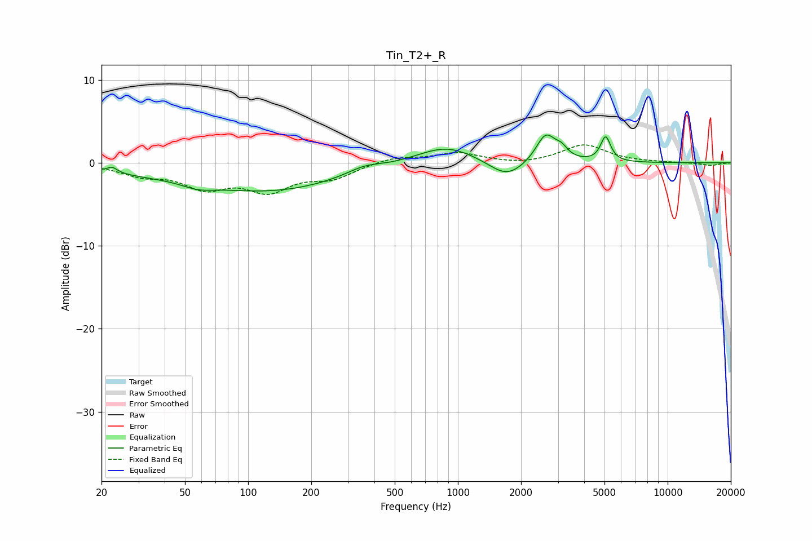

# Tin_T2+_R
See [usage instructions](https://github.com/jaakkopasanen/AutoEq#usage) for more options and info.

### Parametric EQs
Apply preamp of -3.5 dB when using parametric equalizer.

|   # | Type    |   Fc (Hz) |    Q |   Gain (dB) |
|-----|---------|-----------|------|-------------|
|   1 | Peaking |        22 | 5.99 |         0.6 |
|   2 | Peaking |        30 | 0.72 |        -0.7 |
|   3 | Peaking |        58 | 1.86 |        -0.7 |
|   4 | Peaking |       127 | 0.41 |        -3.3 |
|   5 | Peaking |       357 | 1.7  |         0.8 |
|   6 | Peaking |       879 | 0.99 |         2.2 |
|   7 | Peaking |      1710 | 1.65 |        -2.2 |
|   8 | Peaking |      2624 | 3.03 |         3.5 |
|   9 | Peaking |      3121 | 4.81 |         1   |
|  10 | Peaking |      5062 | 6    |         3   |

### Fixed Band EQs
When using fixed band (also called graphic) equalizer, apply preamp of **-2.3 dB** (if available) and set gains manually with these parameters.

|   # | Type    |   Fc (Hz) |    Q |   Gain (dB) |
|-----|---------|-----------|------|-------------|
|   1 | Peaking |        31 | 1.41 |        -1.3 |
|   2 | Peaking |        62 | 1.41 |        -2.7 |
|   3 | Peaking |       125 | 1.41 |        -3   |
|   4 | Peaking |       250 | 1.41 |        -1.6 |
|   5 | Peaking |       500 | 1.41 |         0.7 |
|   6 | Peaking |      1000 | 1.41 |         1.2 |
|   7 | Peaking |      2000 | 1.41 |        -0.3 |
|   8 | Peaking |      4000 | 1.41 |         2.2 |
|   9 | Peaking |      8000 | 1.41 |         0   |
|  10 | Peaking |     16000 | 1.41 |        -0.3 |

### Graphs

