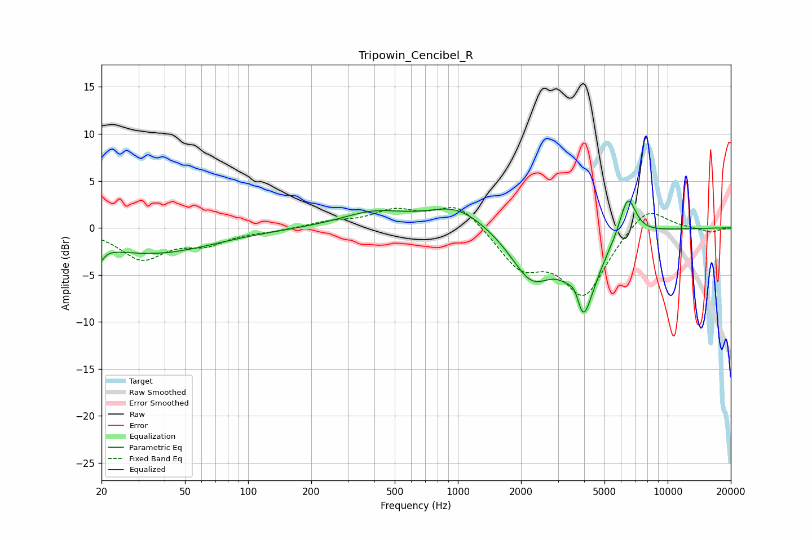

# Tripowin_Cencibel_R
See [usage instructions](https://github.com/jaakkopasanen/AutoEq#usage) for more options and info.

### Parametric EQs
Apply preamp of -3.0 dB when using parametric equalizer.

|   # | Type    |   Fc (Hz) |    Q |   Gain (dB) |
|-----|---------|-----------|------|-------------|
|   1 | Peaking |        20 | 5.85 |        -2.9 |
|   2 | Peaking |        20 | 5.98 |         1.5 |
|   3 | Peaking |        35 | 0.48 |        -2.7 |
|   4 | Peaking |       397 | 0.9  |         1.6 |
|   5 | Peaking |       990 | 1.04 |         2.3 |
|   6 | Peaking |      2248 | 1.41 |        -5.1 |
|   7 | Peaking |      3628 | 4.98 |         2.1 |
|   8 | Peaking |      3983 | 2.44 |       -10.6 |
|   9 | Peaking |      4164 | 3.98 |         1.6 |
|  10 | Peaking |      6456 | 3.51 |         4.5 |

### Fixed Band EQs
When using fixed band (also called graphic) equalizer, apply preamp of **-2.3 dB** (if available) and set gains manually with these parameters.

|   # | Type    |   Fc (Hz) |    Q |   Gain (dB) |
|-----|---------|-----------|------|-------------|
|   1 | Peaking |        31 | 1.41 |        -3.2 |
|   2 | Peaking |        62 | 1.41 |        -1.5 |
|   3 | Peaking |       125 | 1.41 |        -0.3 |
|   4 | Peaking |       250 | 1.41 |         0.6 |
|   5 | Peaking |       500 | 1.41 |         1.7 |
|   6 | Peaking |      1000 | 1.41 |         2.7 |
|   7 | Peaking |      2000 | 1.41 |        -3.9 |
|   8 | Peaking |      4000 | 1.41 |        -6.9 |
|   9 | Peaking |      8000 | 1.41 |         2.6 |
|  10 | Peaking |     16000 | 1.41 |        -0.5 |

### Graphs

