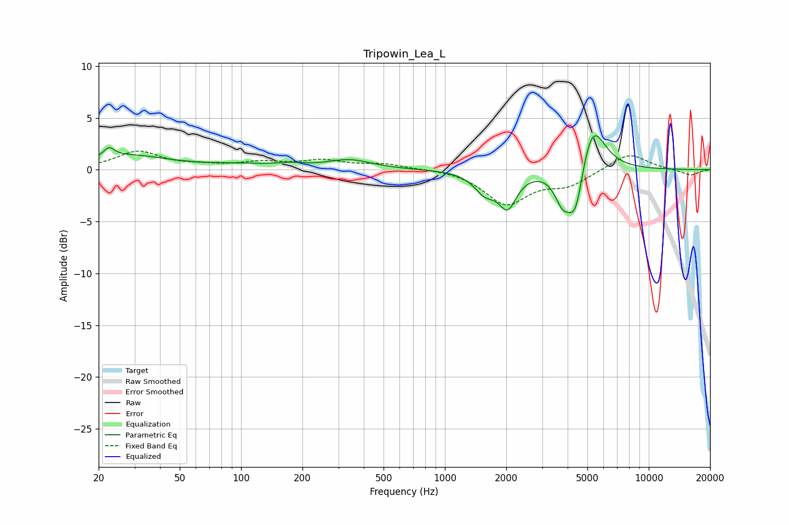

# Tripowin_Lea_L
See [usage instructions](https://github.com/jaakkopasanen/AutoEq#usage) for more options and info.

### Parametric EQs
Apply preamp of -3.4 dB when using parametric equalizer.

|   # | Type    |   Fc (Hz) |    Q |   Gain (dB) |
|-----|---------|-----------|------|-------------|
|   1 | Peaking |        22 | 5.53 |         0.9 |
|   2 | Peaking |        28 | 0.72 |         1.3 |
|   3 | Peaking |       100 | 0.84 |         0.4 |
|   4 | Peaking |       175 | 2.15 |         0.3 |
|   5 | Peaking |       340 | 1.31 |         0.9 |
|   6 | Peaking |      1572 | 2.63 |        -1.9 |
|   7 | Peaking |      2033 | 3.23 |        -3.2 |
|   8 | Peaking |      3778 | 3.52 |        -2.8 |
|   9 | Peaking |      4378 | 3.51 |        -5   |
|  10 | Peaking |      5256 | 2.24 |         5.2 |

### Fixed Band EQs
When using fixed band (also called graphic) equalizer, apply preamp of **-1.9 dB** (if available) and set gains manually with these parameters.

|   # | Type    |   Fc (Hz) |    Q |   Gain (dB) |
|-----|---------|-----------|------|-------------|
|   1 | Peaking |        31 | 1.41 |         1.7 |
|   2 | Peaking |        62 | 1.41 |         0.3 |
|   3 | Peaking |       125 | 1.41 |         0.6 |
|   4 | Peaking |       250 | 1.41 |         0.8 |
|   5 | Peaking |       500 | 1.41 |         0.5 |
|   6 | Peaking |      1000 | 1.41 |         0.1 |
|   7 | Peaking |      2000 | 1.41 |        -3.2 |
|   8 | Peaking |      4000 | 1.41 |        -1.4 |
|   9 | Peaking |      8000 | 1.41 |         1.6 |
|  10 | Peaking |     16000 | 1.41 |        -0.6 |

### Graphs

