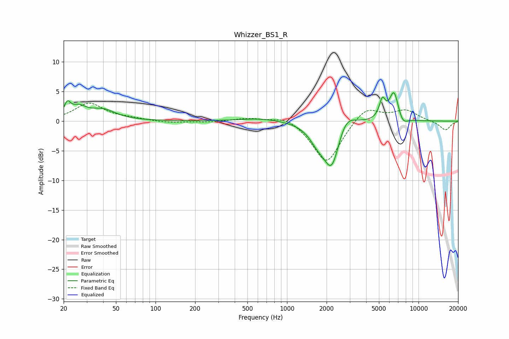

# Whizzer_BS1_R
See [usage instructions](https://github.com/jaakkopasanen/AutoEq#usage) for more options and info.

### Parametric EQs
Apply preamp of -4.9 dB when using parametric equalizer.

|   # | Type    |   Fc (Hz) |    Q |   Gain (dB) |
|-----|---------|-----------|------|-------------|
|   1 | Peaking |        21 | 5.99 |         2.1 |
|   2 | Peaking |        26 | 2.42 |         1.9 |
|   3 | Peaking |        40 | 1.46 |         1.8 |
|   4 | Peaking |       633 | 0.9  |         0.5 |
|   5 | Peaking |      1713 | 2.2  |        -2.4 |
|   6 | Peaking |      2191 | 2.29 |        -7.8 |
|   7 | Peaking |      2777 | 2.05 |         2.9 |
|   8 | Peaking |      5310 | 5.99 |         3.1 |
|   9 | Peaking |      6508 | 3.86 |         5   |
|  10 | Peaking |      7578 | 3.76 |        -1.4 |

### Fixed Band EQs
When using fixed band (also called graphic) equalizer, apply preamp of **-3.1 dB** (if available) and set gains manually with these parameters.

|   # | Type    |   Fc (Hz) |    Q |   Gain (dB) |
|-----|---------|-----------|------|-------------|
|   1 | Peaking |        31 | 1.41 |         3   |
|   2 | Peaking |        62 | 1.41 |         0.4 |
|   3 | Peaking |       125 | 1.41 |        -0.3 |
|   4 | Peaking |       250 | 1.41 |        -0.2 |
|   5 | Peaking |       500 | 1.41 |         0.5 |
|   6 | Peaking |      1000 | 1.41 |         1.1 |
|   7 | Peaking |      2000 | 1.41 |        -7.3 |
|   8 | Peaking |      4000 | 1.41 |         2.7 |
|   9 | Peaking |      8000 | 1.41 |         1.8 |
|  10 | Peaking |     16000 | 1.41 |        -1.6 |

### Graphs

