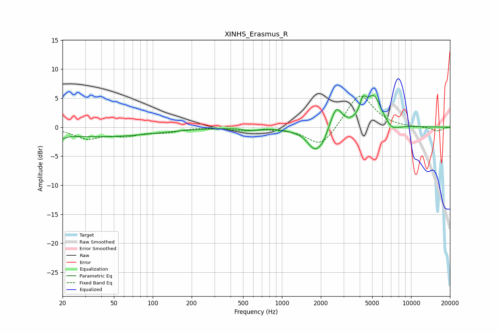

# XINHS_Erasmus_R
See [usage instructions](https://github.com/jaakkopasanen/AutoEq#usage) for more options and info.

### Parametric EQs
Apply preamp of -5.6 dB when using parametric equalizer.

|   # | Type    |   Fc (Hz) |    Q |   Gain (dB) |
|-----|---------|-----------|------|-------------|
|   1 | Peaking |        20 | 4.65 |        -0.6 |
|   2 | Peaking |        39 | 0.32 |        -1.6 |
|   3 | Peaking |       571 | 2.41 |        -0.4 |
|   4 | Peaking |      1305 | 1.46 |        -0.4 |
|   5 | Peaking |      1808 | 2.51 |        -3.8 |
|   6 | Peaking |      2094 | 4.69 |        -1.1 |
|   7 | Peaking |      2638 | 3.42 |         3.5 |
|   8 | Peaking |      4234 | 5.67 |         2.7 |
|   9 | Peaking |      5151 | 2.3  |         5.3 |
|  10 | Peaking |      7107 | 2.45 |        -1.3 |

### Fixed Band EQs
When using fixed band (also called graphic) equalizer, apply preamp of **-5.4 dB** (if available) and set gains manually with these parameters.

|   # | Type    |   Fc (Hz) |    Q |   Gain (dB) |
|-----|---------|-----------|------|-------------|
|   1 | Peaking |        31 | 1.41 |        -1.8 |
|   2 | Peaking |        62 | 1.41 |        -1.2 |
|   3 | Peaking |       125 | 1.41 |        -0.8 |
|   4 | Peaking |       250 | 1.41 |         0.1 |
|   5 | Peaking |       500 | 1.41 |        -0.5 |
|   6 | Peaking |      1000 | 1.41 |        -0.1 |
|   7 | Peaking |      2000 | 1.41 |        -3.5 |
|   8 | Peaking |      4000 | 1.41 |         6   |
|   9 | Peaking |      8000 | 1.41 |        -0.1 |
|  10 | Peaking |     16000 | 1.41 |        -0.7 |

### Graphs

