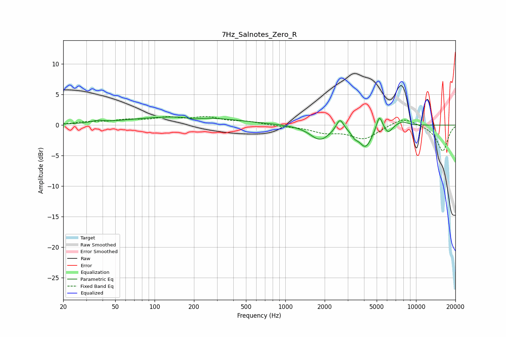

# 7Hz_Salnotes_Zero_R
See [usage instructions](https://github.com/jaakkopasanen/AutoEq#usage) for more options and info.

### Parametric EQs
Apply preamp of -1.4 dB when using parametric equalizer.

|   # | Type    |   Fc (Hz) |    Q |   Gain (dB) |
|-----|---------|-----------|------|-------------|
|   1 | Peaking |        37 | 3.48 |         0.3 |
|   2 | Peaking |       161 | 0.35 |         1.4 |
|   3 | Peaking |       201 | 2.82 |        -0.3 |
|   4 | Peaking |      1844 | 1.87 |        -2.4 |
|   5 | Peaking |      2616 | 5.04 |         2   |
|   6 | Peaking |      3388 | 5.79 |        -0.8 |
|   7 | Peaking |      4106 | 2.74 |        -3.5 |
|   8 | Peaking |      5240 | 5.97 |         2.5 |
|   9 | Peaking |      6129 | 4.88 |        -1.2 |
|  10 | Peaking |      7802 | 2.79 |         0.7 |

### Fixed Band EQs
When using fixed band (also called graphic) equalizer, apply preamp of **-1.5 dB** (if available) and set gains manually with these parameters.

|   # | Type    |   Fc (Hz) |    Q |   Gain (dB) |
|-----|---------|-----------|------|-------------|
|   1 | Peaking |        31 | 1.41 |         0.4 |
|   2 | Peaking |        62 | 1.41 |         0.7 |
|   3 | Peaking |       125 | 1.41 |         1   |
|   4 | Peaking |       250 | 1.41 |         1.1 |
|   5 | Peaking |       500 | 1.41 |         0.5 |
|   6 | Peaking |      1000 | 1.41 |        -0.2 |
|   7 | Peaking |      2000 | 1.41 |        -1.1 |
|   8 | Peaking |      4000 | 1.41 |        -2.2 |
|   9 | Peaking |      8000 | 1.41 |         1.4 |
|  10 | Peaking |     16000 | 1.41 |        -4.3 |

### Graphs

