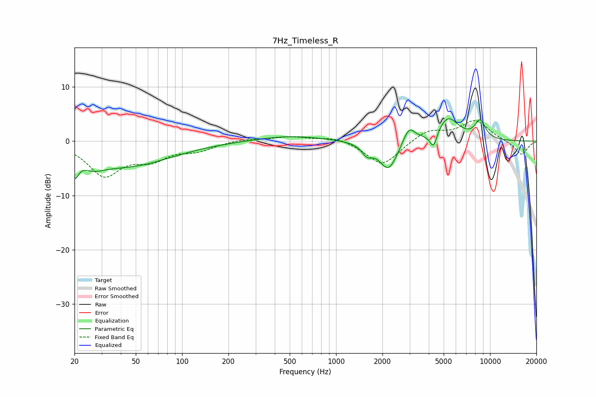

# 7Hz_Timeless_R
See [usage instructions](https://github.com/jaakkopasanen/AutoEq#usage) for more options and info.

### Parametric EQs
Apply preamp of -4.2 dB when using parametric equalizer.

|   # | Type    |   Fc (Hz) |    Q |   Gain (dB) |
|-----|---------|-----------|------|-------------|
|   1 | Peaking |        20 | 5.77 |        -3.5 |
|   2 | Peaking |        26 | 1.83 |        -1.8 |
|   3 | Peaking |        44 | 0.49 |        -4.4 |
|   4 | Peaking |       503 | 0.66 |         1   |
|   5 | Peaking |      1590 | 4.17 |        -1.8 |
|   6 | Peaking |      2194 | 2.36 |        -5.5 |
|   7 | Peaking |      2975 | 3.47 |         3.2 |
|   8 | Peaking |      4289 | 6    |        -3   |
|   9 | Peaking |      5330 | 1.97 |         4.3 |
|  10 | Peaking |      8621 | 3.75 |         3.3 |

### Fixed Band EQs
When using fixed band (also called graphic) equalizer, apply preamp of **-3.9 dB** (if available) and set gains manually with these parameters.

|   # | Type    |   Fc (Hz) |    Q |   Gain (dB) |
|-----|---------|-----------|------|-------------|
|   1 | Peaking |        31 | 1.41 |        -6.1 |
|   2 | Peaking |        62 | 1.41 |        -2.9 |
|   3 | Peaking |       125 | 1.41 |        -1.5 |
|   4 | Peaking |       250 | 1.41 |         0.4 |
|   5 | Peaking |       500 | 1.41 |         0.8 |
|   6 | Peaking |      1000 | 1.41 |         0.9 |
|   7 | Peaking |      2000 | 1.41 |        -4.6 |
|   8 | Peaking |      4000 | 1.41 |         2.1 |
|   9 | Peaking |      8000 | 1.41 |         3.7 |
|  10 | Peaking |     16000 | 1.41 |        -2.6 |

### Graphs

