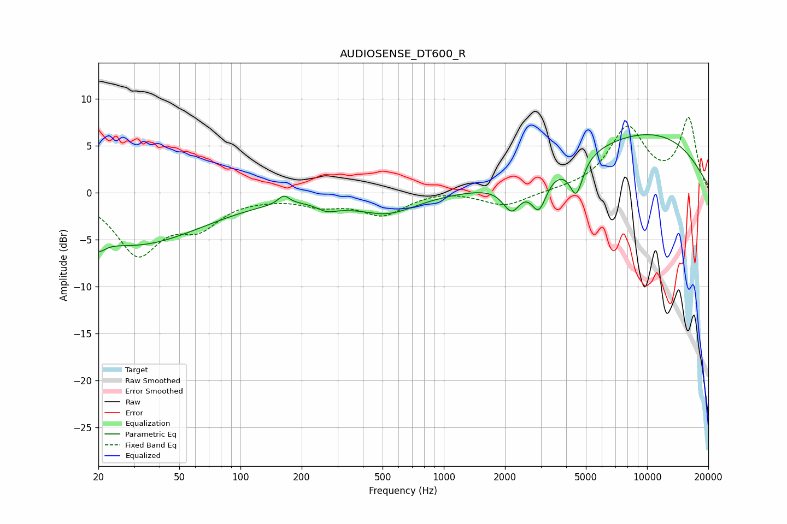

# AUDIOSENSE_DT600_R
See [usage instructions](https://github.com/jaakkopasanen/AutoEq#usage) for more options and info.

### Parametric EQs
Apply preamp of -6.3 dB when using parametric equalizer.

|   # | Type    |   Fc (Hz) |    Q |   Gain (dB) |
|-----|---------|-----------|------|-------------|
|   1 | Peaking |        20 | 4.18 |        -1.3 |
|   2 | Peaking |        30 | 0.42 |        -5.5 |
|   3 | Peaking |       163 | 5.22 |         1   |
|   4 | Peaking |       266 | 2.84 |        -0.9 |
|   5 | Peaking |       332 | 2.78 |        -0.2 |
|   6 | Peaking |       523 | 0.96 |        -2.1 |
|   7 | Peaking |      2156 | 3.23 |        -2.8 |
|   8 | Peaking |      2937 | 3.79 |        -3.5 |
|   9 | Peaking |      4483 | 4.26 |        -3.8 |
|  10 | Peaking |      9762 | 0.33 |         6.3 |

### Fixed Band EQs
When using fixed band (also called graphic) equalizer, apply preamp of **-8.1 dB** (if available) and set gains manually with these parameters.

|   # | Type    |   Fc (Hz) |    Q |   Gain (dB) |
|-----|---------|-----------|------|-------------|
|   1 | Peaking |        31 | 1.41 |        -6.2 |
|   2 | Peaking |        62 | 1.41 |        -3.1 |
|   3 | Peaking |       125 | 1.41 |        -0.2 |
|   4 | Peaking |       250 | 1.41 |        -1.1 |
|   5 | Peaking |       500 | 1.41 |        -2.2 |
|   6 | Peaking |      1000 | 1.41 |         0.4 |
|   7 | Peaking |      2000 | 1.41 |        -1.5 |
|   8 | Peaking |      4000 | 1.41 |         0.1 |
|   9 | Peaking |      8000 | 1.41 |         6.7 |
|  10 | Peaking |     16000 | 1.41 |         7.7 |

### Graphs

