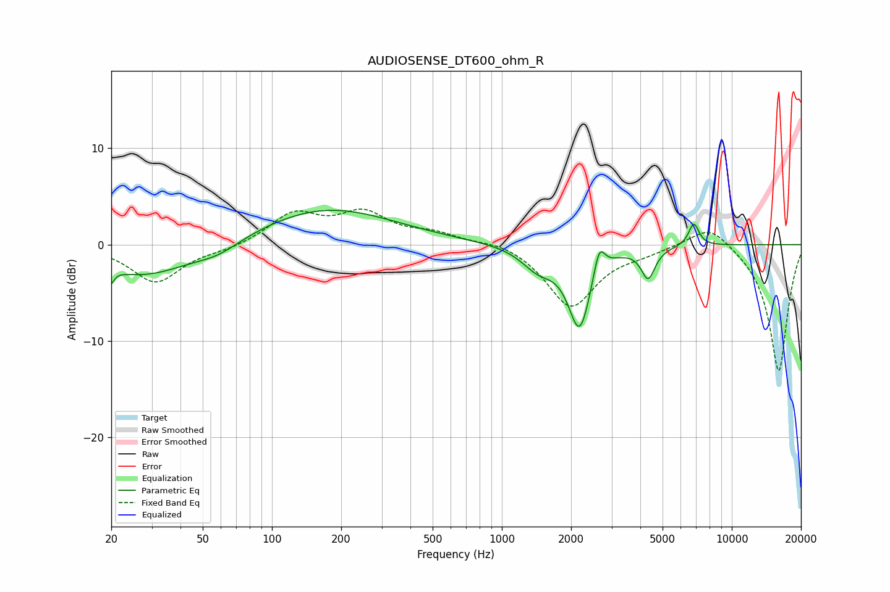

# AUDIOSENSE_DT600_ohm_R
See [usage instructions](https://github.com/jaakkopasanen/AutoEq#usage) for more options and info.

### Parametric EQs
Apply preamp of -3.6 dB when using parametric equalizer.

|   # | Type    |   Fc (Hz) |    Q |   Gain (dB) |
|-----|---------|-----------|------|-------------|
|   1 | Peaking |        20 | 5.96 |        -4   |
|   2 | Peaking |        20 | 5.76 |         2.6 |
|   3 | Peaking |        28 | 0.68 |        -3.3 |
|   4 | Peaking |        58 | 1.43 |        -1.1 |
|   5 | Peaking |       172 | 0.48 |         3.8 |
|   6 | Peaking |      1438 | 1.95 |        -2.1 |
|   7 | Peaking |      2178 | 2.81 |        -8.4 |
|   8 | Peaking |      2650 | 5.83 |         3.1 |
|   9 | Peaking |      4327 | 4.74 |        -3.1 |
|  10 | Peaking |      6835 | 6    |         2.4 |

### Fixed Band EQs
When using fixed band (also called graphic) equalizer, apply preamp of **-3.8 dB** (if available) and set gains manually with these parameters.

|   # | Type    |   Fc (Hz) |    Q |   Gain (dB) |
|-----|---------|-----------|------|-------------|
|   1 | Peaking |        31 | 1.41 |        -3.9 |
|   2 | Peaking |        62 | 1.41 |        -0.5 |
|   3 | Peaking |       125 | 1.41 |         3.1 |
|   4 | Peaking |       250 | 1.41 |         3   |
|   5 | Peaking |       500 | 1.41 |         1   |
|   6 | Peaking |      1000 | 1.41 |         0.5 |
|   7 | Peaking |      2000 | 1.41 |        -6.5 |
|   8 | Peaking |      4000 | 1.41 |        -0.6 |
|   9 | Peaking |      8000 | 1.41 |         2.4 |
|  10 | Peaking |     16000 | 1.41 |       -13.2 |

### Graphs

