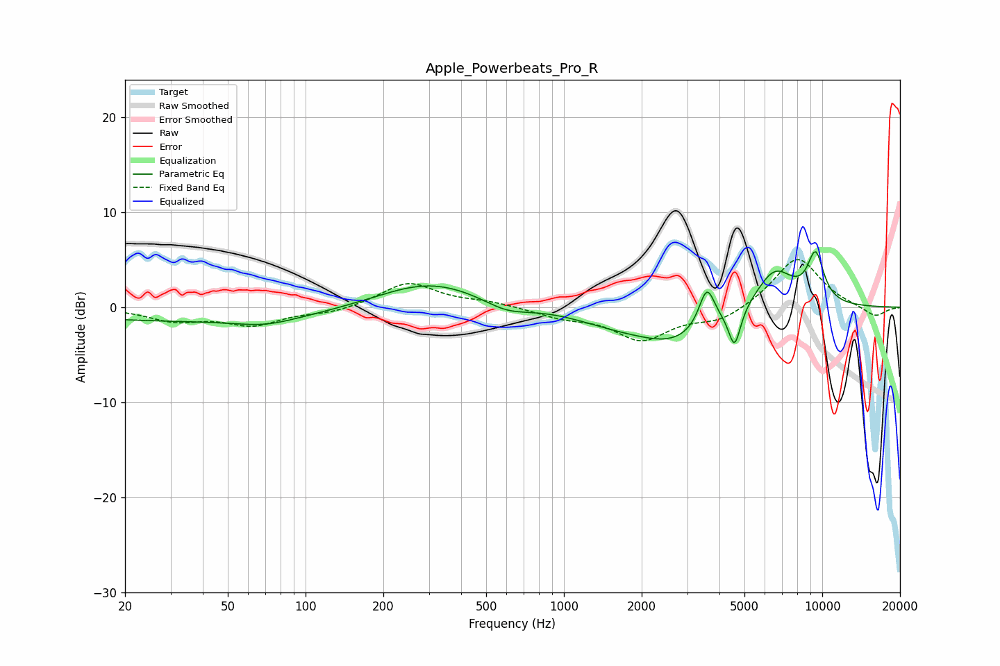

# Apple_Powerbeats_Pro_R
See [usage instructions](https://github.com/jaakkopasanen/AutoEq#usage) for more options and info.

### Parametric EQs
Apply preamp of -5.9 dB when using parametric equalizer.

|   # | Type    |   Fc (Hz) |    Q |   Gain (dB) |
|-----|---------|-----------|------|-------------|
|   1 | Peaking |        39 | 0.23 |        -1.4 |
|   2 | Peaking |        70 | 1.22 |        -0.8 |
|   3 | Peaking |       302 | 0.67 |         2.9 |
|   4 | Peaking |       598 | 1.53 |        -1.2 |
|   5 | Peaking |      1544 | 0.89 |        -1.1 |
|   6 | Peaking |      2699 | 0.9  |        -3.3 |
|   7 | Peaking |      3576 | 4.61 |         4.2 |
|   8 | Peaking |      4580 | 6    |        -4.1 |
|   9 | Peaking |      6547 | 1.8  |         4.2 |
|  10 | Peaking |      9424 | 3.83 |         5.1 |

### Fixed Band EQs
When using fixed band (also called graphic) equalizer, apply preamp of **-5.1 dB** (if available) and set gains manually with these parameters.

|   # | Type    |   Fc (Hz) |    Q |   Gain (dB) |
|-----|---------|-----------|------|-------------|
|   1 | Peaking |        31 | 1.41 |        -1.3 |
|   2 | Peaking |        62 | 1.41 |        -1.8 |
|   3 | Peaking |       125 | 1.41 |        -0.6 |
|   4 | Peaking |       250 | 1.41 |         2.6 |
|   5 | Peaking |       500 | 1.41 |         0.5 |
|   6 | Peaking |      1000 | 1.41 |        -0.9 |
|   7 | Peaking |      2000 | 1.41 |        -3.3 |
|   8 | Peaking |      4000 | 1.41 |        -1.4 |
|   9 | Peaking |      8000 | 1.41 |         5.4 |
|  10 | Peaking |     16000 | 1.41 |        -1.1 |

### Graphs

