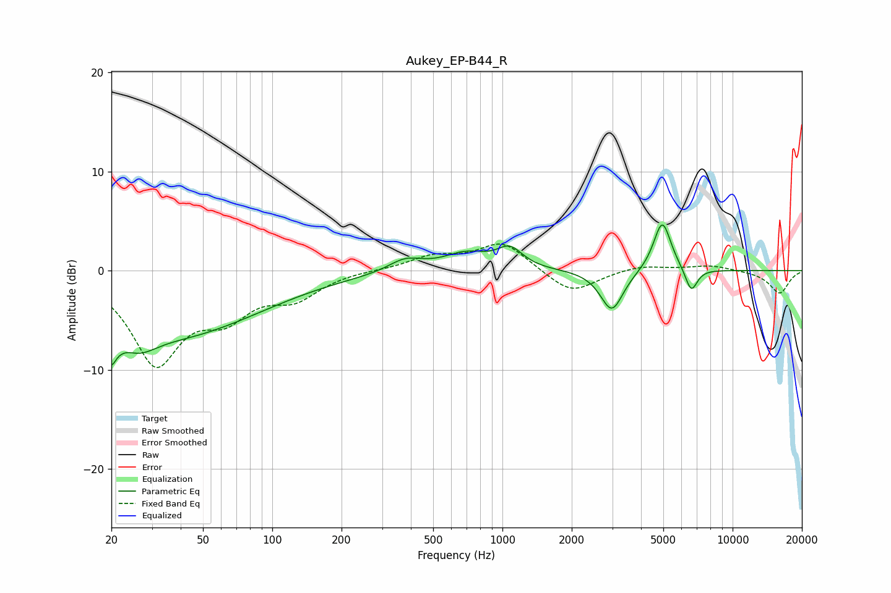

# Aukey_EP-B44_R
See [usage instructions](https://github.com/jaakkopasanen/AutoEq#usage) for more options and info.

### Parametric EQs
Apply preamp of -4.7 dB when using parametric equalizer.

|   # | Type    |   Fc (Hz) |    Q |   Gain (dB) |
|-----|---------|-----------|------|-------------|
|   1 | Peaking |        20 | 5.09 |        -6.9 |
|   2 | Peaking |        20 | 5.47 |         3.5 |
|   3 | Peaking |        26 | 1.86 |        -1.9 |
|   4 | Peaking |        37 | 0.37 |        -6.4 |
|   5 | Peaking |       379 | 1.91 |         1.3 |
|   6 | Peaking |       692 | 1.46 |         1.6 |
|   7 | Peaking |      1076 | 2.54 |         2   |
|   8 | Peaking |      2987 | 2.85 |        -4.2 |
|   9 | Peaking |      4948 | 3.65 |         5.2 |
|  10 | Peaking |      6612 | 5.16 |        -2.4 |

### Fixed Band EQs
When using fixed band (also called graphic) equalizer, apply preamp of **-2.8 dB** (if available) and set gains manually with these parameters.

|   # | Type    |   Fc (Hz) |    Q |   Gain (dB) |
|-----|---------|-----------|------|-------------|
|   1 | Peaking |        31 | 1.41 |        -9   |
|   2 | Peaking |        62 | 1.41 |        -3.7 |
|   3 | Peaking |       125 | 1.41 |        -2.4 |
|   4 | Peaking |       250 | 1.41 |         0.1 |
|   5 | Peaking |       500 | 1.41 |         1.3 |
|   6 | Peaking |      1000 | 1.41 |         2.9 |
|   7 | Peaking |      2000 | 1.41 |        -2.4 |
|   8 | Peaking |      4000 | 1.41 |         0.6 |
|   9 | Peaking |      8000 | 1.41 |         0.5 |
|  10 | Peaking |     16000 | 1.41 |        -2.3 |

### Graphs

