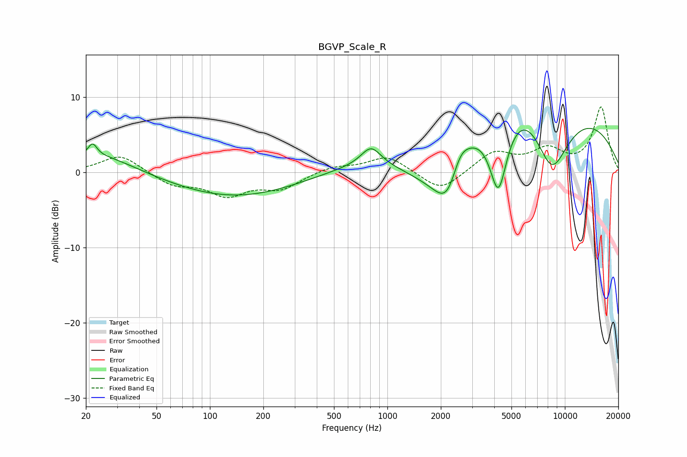

# BGVP_Scale_R
See [usage instructions](https://github.com/jaakkopasanen/AutoEq#usage) for more options and info.

### Parametric EQs
Apply preamp of -6.0 dB when using parametric equalizer.

|   # | Type    |   Fc (Hz) |    Q |   Gain (dB) |
|-----|---------|-----------|------|-------------|
|   1 | Peaking |        22 | 5.76 |         1.6 |
|   2 | Peaking |        23 | 0.69 |         2.6 |
|   3 | Peaking |       140 | 0.39 |        -3.3 |
|   4 | Peaking |       809 | 2.54 |         2.5 |
|   5 | Peaking |      1678 | 0.6  |        -7.1 |
|   6 | Peaking |      2236 | 1.5  |        -9.7 |
|   7 | Peaking |      2532 | 2.5  |         4.1 |
|   8 | Peaking |      4220 | 2.36 |       -12.3 |
|   9 | Peaking |      5182 | 0.26 |        18.5 |
|  10 | Peaking |      8397 | 1.02 |       -13.1 |

### Fixed Band EQs
When using fixed band (also called graphic) equalizer, apply preamp of **-8.8 dB** (if available) and set gains manually with these parameters.

|   # | Type    |   Fc (Hz) |    Q |   Gain (dB) |
|-----|---------|-----------|------|-------------|
|   1 | Peaking |        31 | 1.41 |         2.4 |
|   2 | Peaking |        62 | 1.41 |        -1.6 |
|   3 | Peaking |       125 | 1.41 |        -2.8 |
|   4 | Peaking |       250 | 1.41 |        -2   |
|   5 | Peaking |       500 | 1.41 |         0.8 |
|   6 | Peaking |      1000 | 1.41 |         2.2 |
|   7 | Peaking |      2000 | 1.41 |        -2.7 |
|   8 | Peaking |      4000 | 1.41 |         2.7 |
|   9 | Peaking |      8000 | 1.41 |         2.7 |
|  10 | Peaking |     16000 | 1.41 |         8.6 |

### Graphs

