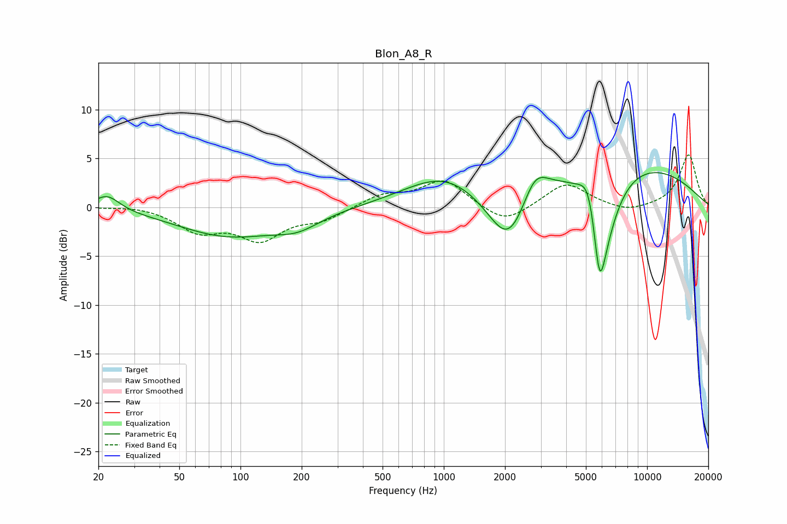

# Blon_A8_R
See [usage instructions](https://github.com/jaakkopasanen/AutoEq#usage) for more options and info.

### Parametric EQs
Apply preamp of -3.6 dB when using parametric equalizer.

|   # | Type    |   Fc (Hz) |    Q |   Gain (dB) |
|-----|---------|-----------|------|-------------|
|   1 | Peaking |        22 | 2.28 |         1.6 |
|   2 | Peaking |        88 | 0.56 |        -2.9 |
|   3 | Peaking |       191 | 1.27 |        -1.3 |
|   4 | Peaking |       994 | 0.73 |         3   |
|   5 | Peaking |      2096 | 1.29 |        -7.1 |
|   6 | Peaking |      2795 | 2.22 |         3.2 |
|   7 | Peaking |      5199 | 3.09 |         3.8 |
|   8 | Peaking |      5831 | 5    |        -5.9 |
|   9 | Peaking |      6047 | 1.79 |        -8   |
|  10 | Peaking |      6603 | 0.29 |         5.3 |

### Fixed Band EQs
When using fixed band (also called graphic) equalizer, apply preamp of **-5.5 dB** (if available) and set gains manually with these parameters.

|   # | Type    |   Fc (Hz) |    Q |   Gain (dB) |
|-----|---------|-----------|------|-------------|
|   1 | Peaking |        31 | 1.41 |         0.2 |
|   2 | Peaking |        62 | 1.41 |        -2.3 |
|   3 | Peaking |       125 | 1.41 |        -3.1 |
|   4 | Peaking |       250 | 1.41 |        -1.2 |
|   5 | Peaking |       500 | 1.41 |         1.2 |
|   6 | Peaking |      1000 | 1.41 |         2.8 |
|   7 | Peaking |      2000 | 1.41 |        -1.8 |
|   8 | Peaking |      4000 | 1.41 |         2.5 |
|   9 | Peaking |      8000 | 1.41 |        -0.6 |
|  10 | Peaking |     16000 | 1.41 |         5.4 |

### Graphs

