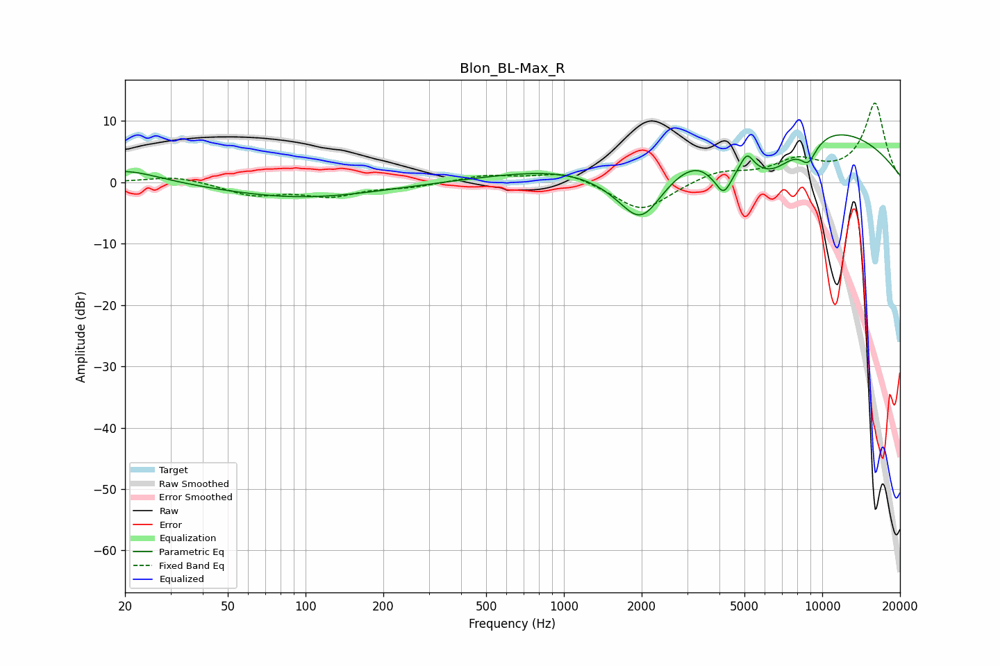

# Blon_BL-Max_R
See [usage instructions](https://github.com/jaakkopasanen/AutoEq#usage) for more options and info.

### Parametric EQs
Apply preamp of -7.8 dB when using parametric equalizer.

|   # | Type    |   Fc (Hz) |    Q |   Gain (dB) |
|-----|---------|-----------|------|-------------|
|   1 | Peaking |        20 | 1.02 |         2.2 |
|   2 | Peaking |        97 | 0.47 |        -2.5 |
|   3 | Peaking |      1990 | 1.09 |       -14.5 |
|   4 | Peaking |      3946 | 6    |         1.1 |
|   5 | Peaking |      4096 | 3.25 |        -7.8 |
|   6 | Peaking |      5116 | 5.98 |         2.4 |
|   7 | Peaking |      5356 | 0.23 |        14.9 |
|   8 | Peaking |      6278 | 1.03 |       -10.2 |
|   9 | Peaking |      8830 | 3.93 |        -3.4 |
|  10 | Peaking |      9970 | 6    |        -0.1 |

### Fixed Band EQs
When using fixed band (also called graphic) equalizer, apply preamp of **-13.0 dB** (if available) and set gains manually with these parameters.

|   # | Type    |   Fc (Hz) |    Q |   Gain (dB) |
|-----|---------|-----------|------|-------------|
|   1 | Peaking |        31 | 1.41 |         1.1 |
|   2 | Peaking |        62 | 1.41 |        -2   |
|   3 | Peaking |       125 | 1.41 |        -2.1 |
|   4 | Peaking |       250 | 1.41 |        -0.7 |
|   5 | Peaking |       500 | 1.41 |         1.1 |
|   6 | Peaking |      1000 | 1.41 |         1.8 |
|   7 | Peaking |      2000 | 1.41 |        -4.9 |
|   8 | Peaking |      4000 | 1.41 |         1.8 |
|   9 | Peaking |      8000 | 1.41 |         3.2 |
|  10 | Peaking |     16000 | 1.41 |        12.8 |

### Graphs

