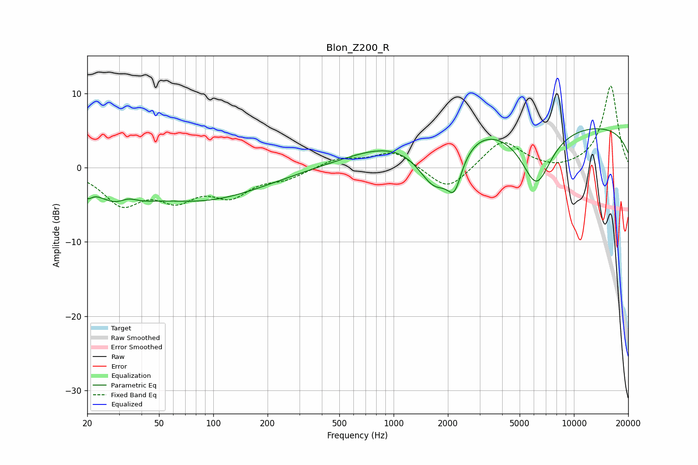

# Blon_Z200_R
See [usage instructions](https://github.com/jaakkopasanen/AutoEq#usage) for more options and info.

### Parametric EQs
Apply preamp of -5.4 dB when using parametric equalizer.

|   # | Type    |   Fc (Hz) |    Q |   Gain (dB) |
|-----|---------|-----------|------|-------------|
|   1 | Peaking |        20 | 5.67 |        -1.4 |
|   2 | Peaking |        31 | 1.15 |        -3.9 |
|   3 | Peaking |        34 | 2.44 |         1.6 |
|   4 | Peaking |        90 | 0.43 |        -4.1 |
|   5 | Peaking |      1079 | 0.53 |         3.1 |
|   6 | Peaking |      1695 | 1.44 |        -6.5 |
|   7 | Peaking |      2176 | 3.52 |        -4.4 |
|   8 | Peaking |      3030 | 0.92 |         1.5 |
|   9 | Peaking |      6194 | 1.64 |        -7.8 |
|  10 | Peaking |     10000 | 0.18 |         5.9 |

### Fixed Band EQs
When using fixed band (also called graphic) equalizer, apply preamp of **-11.1 dB** (if available) and set gains manually with these parameters.

|   # | Type    |   Fc (Hz) |    Q |   Gain (dB) |
|-----|---------|-----------|------|-------------|
|   1 | Peaking |        31 | 1.41 |        -4.6 |
|   2 | Peaking |        62 | 1.41 |        -3.6 |
|   3 | Peaking |       125 | 1.41 |        -3.3 |
|   4 | Peaking |       250 | 1.41 |        -1.2 |
|   5 | Peaking |       500 | 1.41 |         1.3 |
|   6 | Peaking |      1000 | 1.41 |         2.3 |
|   7 | Peaking |      2000 | 1.41 |        -3.3 |
|   8 | Peaking |      4000 | 1.41 |         3.8 |
|   9 | Peaking |      8000 | 1.41 |        -0.5 |
|  10 | Peaking |     16000 | 1.41 |        11.1 |

### Graphs

