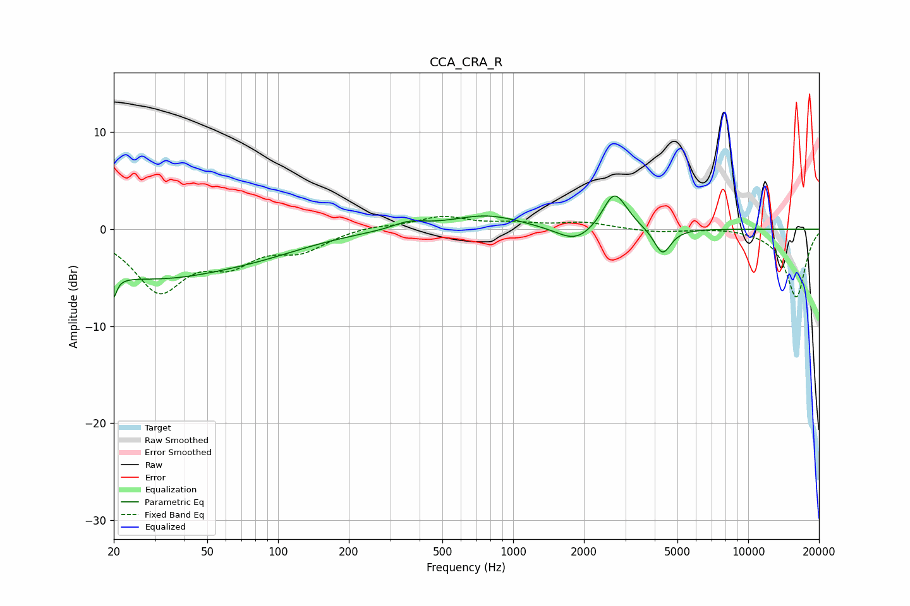

# CCA_CRA_R
See [usage instructions](https://github.com/jaakkopasanen/AutoEq#usage) for more options and info.

### Parametric EQs
Apply preamp of -3.5 dB when using parametric equalizer.

|   # | Type    |   Fc (Hz) |    Q |   Gain (dB) |
|-----|---------|-----------|------|-------------|
|   1 | Peaking |        20 | 5.91 |        -5.6 |
|   2 | Peaking |        20 | 5.99 |         3.2 |
|   3 | Peaking |        29 | 0.39 |        -4.8 |
|   4 | Peaking |        89 | 0.66 |        -1   |
|   5 | Peaking |       360 | 2.05 |         0.7 |
|   6 | Peaking |       770 | 0.94 |         1.5 |
|   7 | Peaking |      1844 | 1.78 |        -1.6 |
|   8 | Peaking |      2664 | 3.06 |         2.9 |
|   9 | Peaking |      2847 | 2.51 |         1.2 |
|  10 | Peaking |      4318 | 3.91 |        -2.7 |

### Fixed Band EQs
When using fixed band (also called graphic) equalizer, apply preamp of **-1.4 dB** (if available) and set gains manually with these parameters.

|   # | Type    |   Fc (Hz) |    Q |   Gain (dB) |
|-----|---------|-----------|------|-------------|
|   1 | Peaking |        31 | 1.41 |        -6.1 |
|   2 | Peaking |        62 | 1.41 |        -2.9 |
|   3 | Peaking |       125 | 1.41 |        -1.9 |
|   4 | Peaking |       250 | 1.41 |         0.4 |
|   5 | Peaking |       500 | 1.41 |         1.2 |
|   6 | Peaking |      1000 | 1.41 |         0.5 |
|   7 | Peaking |      2000 | 1.41 |         0.7 |
|   8 | Peaking |      4000 | 1.41 |        -0.3 |
|   9 | Peaking |      8000 | 1.41 |         0.2 |
|  10 | Peaking |     16000 | 1.41 |        -7   |

### Graphs

